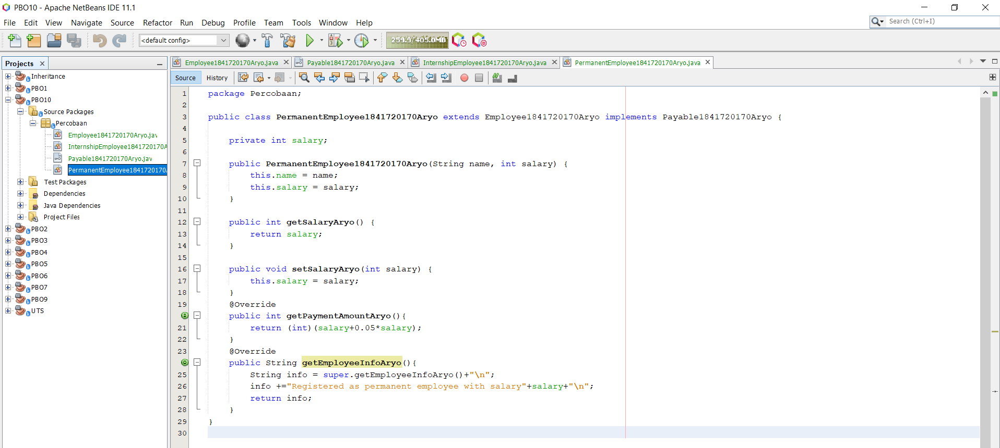
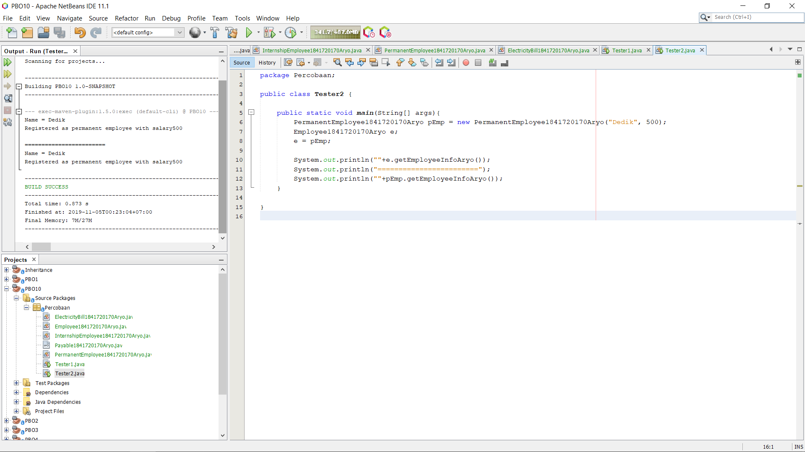
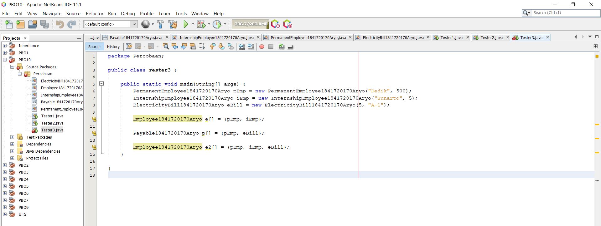
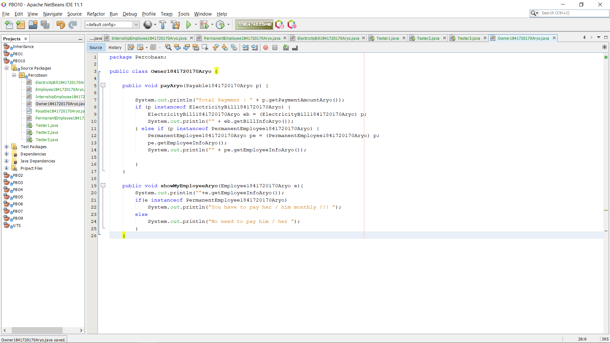
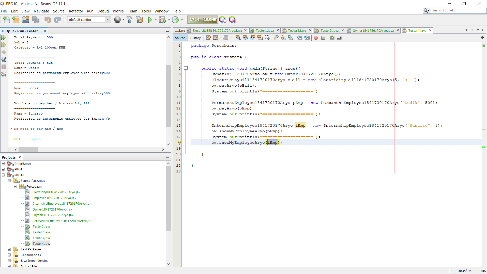

# Laporan Praktikum #10 - POLIMORFISME

## <h1>Kompetensi

Setelah melakukan percobaan pada jobsheet ini, diharapkan mahasiswa
mampu:
a. Memahami konsep dan bentuk dasar polimorfisme
b. Memahami konsep virtual method invication
c. Menerapkan polimorfisme pada pembuatan heterogeneous collection
d. Menerapkan polimorfisme pada parameter/argument method
e. Menerapkan object casting untuk meng-ubah bentuk objek

## <h1>Ringkasan Materi

Polimorfisme merupakan kemampuan objek-objek yang berbeda kelas namun terkait dalam pewarisan untuk merespon secara berbeda terhadap suatu pesan yang sama. 
 
### <h1>Praktikum

<h2>4.1. Langkah Percobaan</h2>

1. Buat class Employee
  
   link kode program :[Employee](../../src/10_Polimorfisme/Percobaan/Employee1841720170Aryo.java)

2. Buat interface Payable
  
   link kode program :[Payable](../../src/10_Polimorfisme/Percobaan/Payable1841720170Aryo.java)

3. Buat class InternshipEmployee, subclass dari Employee
  
   link kode program :[InternshipEmployee](../../src/10_Polimorfisme/Percobaan/InternshipEmployee1841720170Aryo.java)PermanentEmployee1841720170Aryo

4. Buat class PermanentEmployee, subclass dari Employee dan implements ke Payable
  
   link kode program :[PermanentEmployee](../../src/10_Polimorfisme/Percobaan/PermanentEmployee1841720170Aryo.java)

5. Buat class ElectricityBill yang implements ke interface Payable
  
  
   link kode program :[ElectricityBill](../../src/10_Polimorfisme/Percobaan/ElectricityBill1841720170Aryo.java)

 6. Buat class Tester1
  
   link kode program :[Tester](../../src/10_Polimorfisme/Percobaan/Tester1.java)

4.2. Pertanyaan

 1. Class apa sajakah yang merupakan turunan dari class Employee?
 - Ada 2 class yaitu : 
  
  

 2. Class apa sajakah yang implements ke interface Payable?
 - Ada 2 class yaitu : 
  
  

 3. Perhatikan class Tester1, baris ke-10 dan 11. Mengapa e, bisa diisi dengan objek pEmp (merupakan objek dari class PermanentEmployee) dan objek iEmp (merupakan objek dari class InternshipEmploye) ?
 - Karena sudah di deklarasikan di baris sebelumnya.

 4. Perhatikan class Tester1, baris ke-12 dan 13. Mengapa p, bisa diisi dengan objek pEmp (merupakan objek dari class PermanentEmployee) dan objek eBill (merupakan objek dari class ElectricityBill) ?
 - Karena sudah di deklarasikan di baris sebelumnya.

 5. Coba tambahkan sintaks:
 p = iEmp;
 e = eBill;
 pada baris 14 dan 15 (baris terakhir dalam method main) ! Apa yang
 menyebabkan error?
 - error, karena class permanentEmployee dan internshipEmployee adalah turunan dari class interface payable.

 6. Ambil kesimpulan tentang konsep/bentuk dasar polimorfisme!
## <h1>Kesimpulan
 - polimorfisme bisa digunakan jika class saling berelasi atau inheritance dan mempunyai class interface.

<h2>5.1. Langkah Percobaan</h2>

1. Pada percobaan ini masih akan digunakan class-class dan interface
yang digunakan pada percobaan sebelumnya.

2. Buat class baru dengan nama Tester2.
  

3. Jalankan class Tester2, dan akan didapatkan hasil sebagai berikut:
  
    link kode program :[Tester2](../../src/10_Polimorfisme/Percobaan/Tester2.java)

 5.2. Pertanyaan

1. Perhatikan class Tester2 di atas, mengapa pemanggilan
e.getEmployeeInfo() pada baris 8 dan
pEmp.getEmployeeInfo() pada baris 10 menghasilkan hasil
sama?
  - Dikarenakan sudah di deklarasikan bahwa e merupakan pEmp.

2. Mengapa pemanggilan method e.getEmployeeInfo() disebut
sebagai pemanggilan method virtual (virtual method invication),
sedangkan pEmp.getEmployeeInfo() tidak?
  - Dikarenakan pEmp.getEmployeeInfo() berfungsi sebagai passing.

3. Jadi apakah yang dimaksud dari virtual method invocation? Mengapa
disebut virtual?
  - virtual method invocation adalah Satu obyek hanya boleh mempunyai satu bentuk saja, yaitu bentuk yang diberikan ketika obyek dibuat.

<h2>6.1. Langkah Percobaan</h2>

1. Pada percobaan ke-3 ini, masih akan digunakan class-class dan
interface pada percobaan sebelumnya

2. Buat class baru Tester3
 
   link kode program :[Tester3](../../src/10_Polimorfisme/Percobaan/Tester3.java)

6.2. Pertanyaan

1. Perhatikan array e pada baris ke-8, mengapa ia bisa diisi dengan
objek-objek dengan tipe yang berbeda, yaitu objek pEmp (objek dari
PermanentEmployee) dan objek iEmp (objek dari
InternshipEmployee) ?
  - Karena merupakan objek turunan dari class employee.

2. Perhatikan juga baris ke-9, mengapa array p juga biisi dengan objekobjek dengan tipe yang berbeda, yaitu objek pEmp (objek dari
PermanentEmployee) dan objek eBill (objek dari
ElectricityBilling) ?
  - Karena merupakan objek turunan dari class interface Payable.

3. Perhatikan baris ke-10, mengapa terjadi error?
  - Karena eBill bukan termasuk class Employee.

<h2>7.1. Langkah Percobaan </h2>

1. Percobaan 4 ini juga masih menggunakan class-class dan interface
yang digunakan pada percobaan sebelumnya

4. Buat class baru dengan nama Owner. Owner bisa melakukan
pembayaran baik kepada pegawai permanen maupun rekening listrik
melalui method pay(). Selain itu juga bisa menampilkan info pegawai
permanen maupun pegawai magang melalui method
showMyEmployee()
 
   link kode program :[Owner](../../src/10_Polimorfisme/Percobaan/Owner1841720170Aryo.java)

2. Buat class baru Tester4.
 
   link kode program :[Tester4](../../src/10_Polimorfisme/Percobaan/Tester4.java)

7.2. Pertanyaan

1. Perhatikan class Tester4 baris ke-7 dan baris ke-11, mengapa
pemanggilan ow.pay(eBill) dan ow.pay(pEmp) bisa dilakukan,
padahal jika diperhatikan method pay() yang ada di dalam class
Owner memiliki argument/parameter bertipe Payable? Jika
diperhatikan lebih detil eBill merupakan objek dariElectricityBill dan pEmp merupakan objek dari
PermanentEmployee?
  - Dikarenakan di class owner mendklarasikan argument Payable yang sama - sama mengimplementasikan class interface Payable.

2. Jadi apakah tujuan membuat argument bertipe Payable pada
method pay() yang ada di dalam class Owner?
  - Supaya bisa memanggil method getPayAmount.

3. Coba pada baris terakhir method main() yang ada di dalam class
Tester4 ditambahkan perintah ow.pay(iEmp);
  - Error, karena belum dideklarasikan.

4. Perhatikan class Owner, diperlukan untuk apakah sintaks p
instanceof ElectricityBill pada baris ke-6 ?
  - Untuk memeriksa objek tsb implements payable atau tidak.

5. Perhatikan kembali class Owner baris ke-7, untuk apakah casting
objek disana (ElectricityBill eb = (ElectricityBill) p)
diperlukan ? Mengapa objek p yang bertipe Payable harus di-casting
ke dalam objek eb yang bertipe ElectricityBill ?
  - Karena diperlukan mengembalikan ke instan yang dapat memanggil method getBillInfo yang ada pada class ElectricityBill.

## <h1>Tugas 

Dalam suatu permainan, Zombie dan Barrier bisa dihancurkan oleh Plant dan
bisa menyembuhkan diri. Terdapat dua jenis Zombie, yaitu Walking Zombie
dan Jumping Zombie. Kedua Zombie tersebut memiliki cara penyembuhan
yang berbeda, demikian juga cara penghancurannya, yaitu ditentukan oleh
aturan berikut ini:

• Pada WalkingZombie
 o Penyembuhan : Penyembuhan ditentukan berdasar level
zombie yang bersangkutan
 § Jika zombie level 1, maka setiap kali penyembuhan,
health akan bertambah 20%
 § Jika zombie level 2, maka setiap kali penyembuhan,
health akan bertambah 30%
 § Jika zombie level 3, maka setiap kali penyembuhan,
health akan bertambah 40%
 o Penghancuran : setiap kali penghancuran, health akan
berkurang 2%

• Pada Jumping Zombie
 o Penyembuhan : Penyembuhan ditentukan berdasar level
zombie yang bersangkutan
 § Jika zombie level 1, maka setiap kali penyembuhan,
health akan bertambah 30%
 § Jika zombie level 2, maka setiap kali penyembuhan,
health akan bertambah 40%
 § Jika zombie level 3, maka setiap kali penyembuhan,
health akan bertambah 50%
 o Penghancuran : setiap kali penghancuran, health akan
berkurang 1%

Hasil : 

   link kode program :[Zombie](../../src/10_Polimorfisme/Tugas/Zombie1841720170Aryo.java)
   link kode program :[Destroyable](../../src/10_Polimorfisme/Tugas/Destroyable1841720170Aryo.java)
   link kode program :[WalkingZombie](../../src/10_Polimorfisme/Tugas/WalkingZombie1841720170Aryo.java)
   link kode program :[JumpingZombie](../../src/10_Polimorfisme/Tugas/JumpingZombie1841720170Aryo.java)
   link kode program :[Barrier](../../src/10_Polimorfisme/Tugas/Barrier1841720170Aryo.java)
   link kode program :[Plant](../../src/10_Polimorfisme/Tugas/Plant1841720170Aryo.java)
   link kode program :[NewMain](../../src/10_Polimorfisme/Tugas/NewMain.java)

## <h1>Kesimpulan

Polimarfisme juga dapat dikatakan kemampuan sebuah objek untuk memutuskan method mana yang akan diterapkan padanya, tergantung letak objek tersebut pada jenjang pewarisan.

## <h1>Pernyataan Diri

Saya menyatakan isi tugas, kode program, dan laporan praktikum ini dibuat oleh saya sendiri. Saya tidak melakukan plagiasi, kecurangan, menyalin/menggandakan milik orang lain.

Jika saya melakukan plagiasi, kecurangan, atau melanggar hak kekayaan intelektual, saya siap untuk mendapat sanksi atau hukuman sesuai peraturan perundang-undangan yang berlaku.

Ttd,

Aryo Satyo Wandowo Adi - 05

