# Laporan Praktikum #11 - GUI

## <h1>Kompetensi

## <h1>Ringkasan Materi

### <h1>Praktikum

<h2>Percobaan 1: JFrame HelloGUI</h2>

1. Buatlah sebuah project baru di NetBeans dengan nama HelloGui
2. Tambahkan paket Java ke dalam kode program, import javax.swing.*;
3. Pada program utama main(), tuliskan script code berikut
  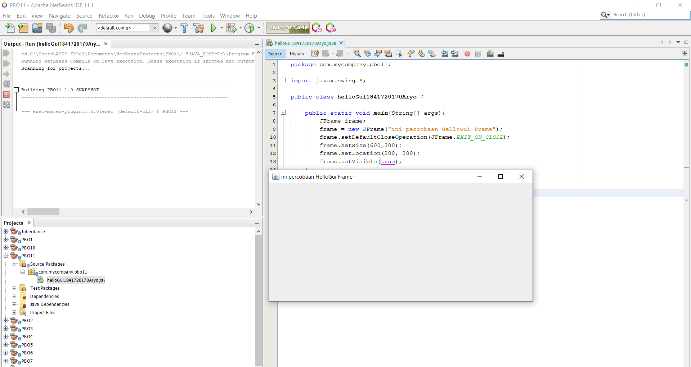
   link kode program :[HelloGui](../../src/11_GUI/p1/helloGui1841720170Aryo.java)

<h2>Percobaan 2: Menangani Input Pada GUI</h2>

1. Buatlah project baru dengan nama MyInputForm
2. Pada kelas MyInputForm tambahkan beberapa library berikut
  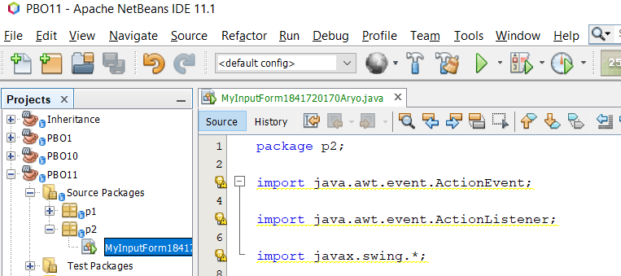

3. Jadikan kelas MyInputForm sebagai turunan dari kelas JFrame
  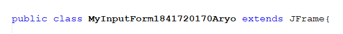

4. Pada kelas MyInputForm tambahkan beberapa variable berikut
  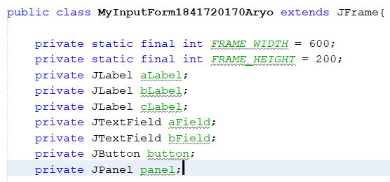

5. Buatlah konstruktor dengan nama MyInputForm() dan tambahkan script berikut
  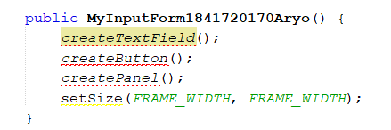

6. Buatlah method createTextField() dan tambahkan script berikut untuk menampilkan Text field sebagai inputan maupun output pada window
  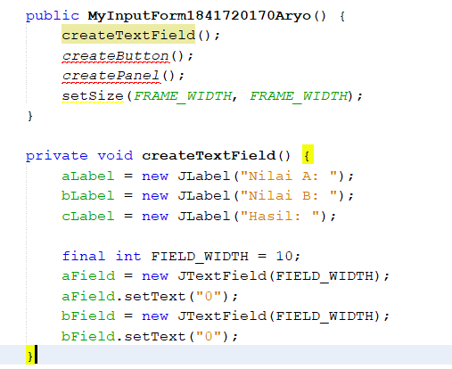

7. Tambahkan method createButton() untuk membuat tampilan button/tombol pada window, dan ketikkan script berikut sebagai event handling ketika button di klik
  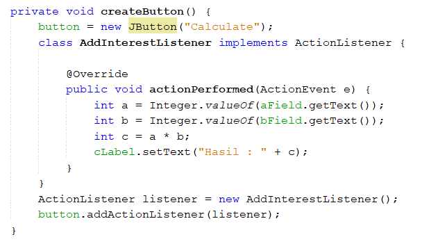

8. Selanjtnya, buat method dengan nama createPanel() yang berfungsi untuk membuat panel dengan menambahkan script berikut
  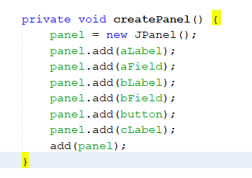

9. Langkah berikutnya, pada main program tambahkan script berikut
  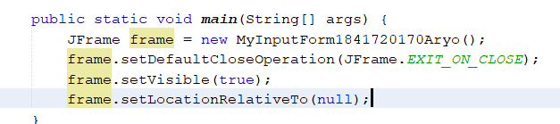

10. Compile dan Run program, maka akan tampil hasil/output perkalian nilai A dan Nilai B sebagai berikut
  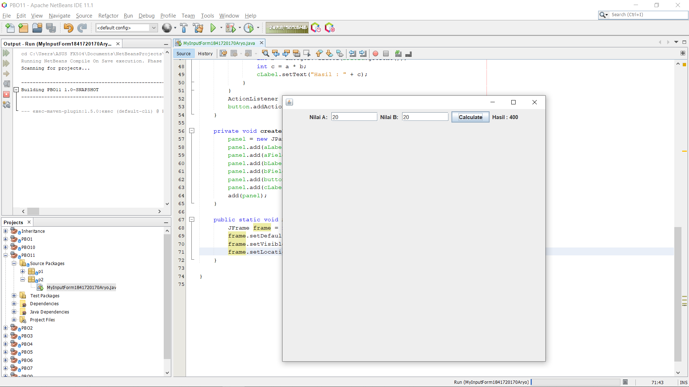
   link kode program :[HelloGui](../../src/11_GUI/p2/MyInputForm1841720170Aryo.java)

<h2>  Pertanyaan </h2>

1. Modifikasi kode program dengan menambahkan JButton baru untuk melakukan fungsi perhitungan penambahan, sehingga ketika button di klik (event click) maka akan menampilkan hasil penambahan dari nilai A dan B
- a

<h2> Percobaan 3: Manajemen Layout </h2>

1. Class Border : 
  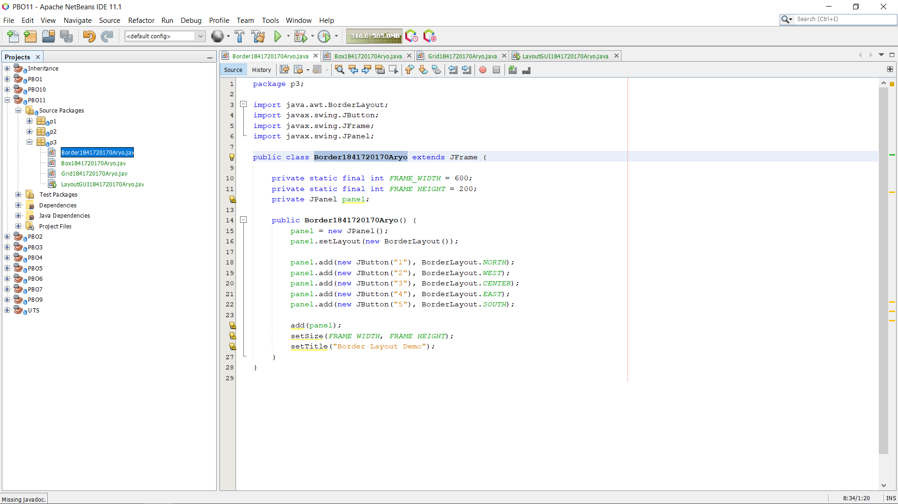
   link kode program :[Border](../../src/11_GUI/p3/Border1841720170Aryo.java)

2. Class Box : 
  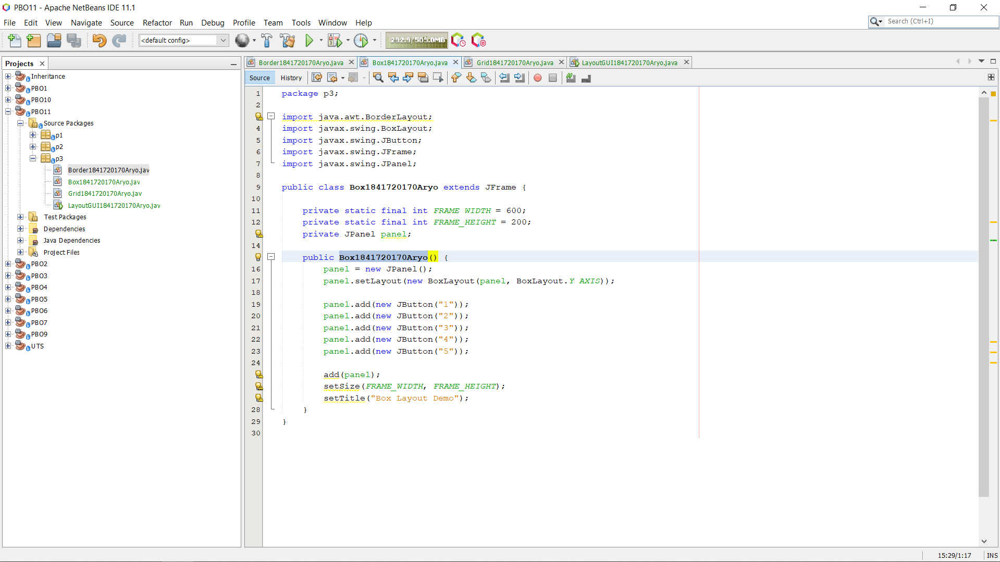
   link kode program :[Border](../../src/11_GUI/p3/Box1841720170Aryo.java)

3. Class Grid :
  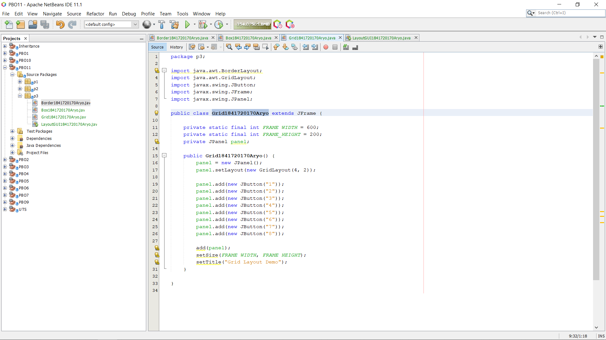
   link kode program :[Grid](../../src/11_GUI/p3/Grid1841720170Aryo.java)

4. Class LayoutGui : 
  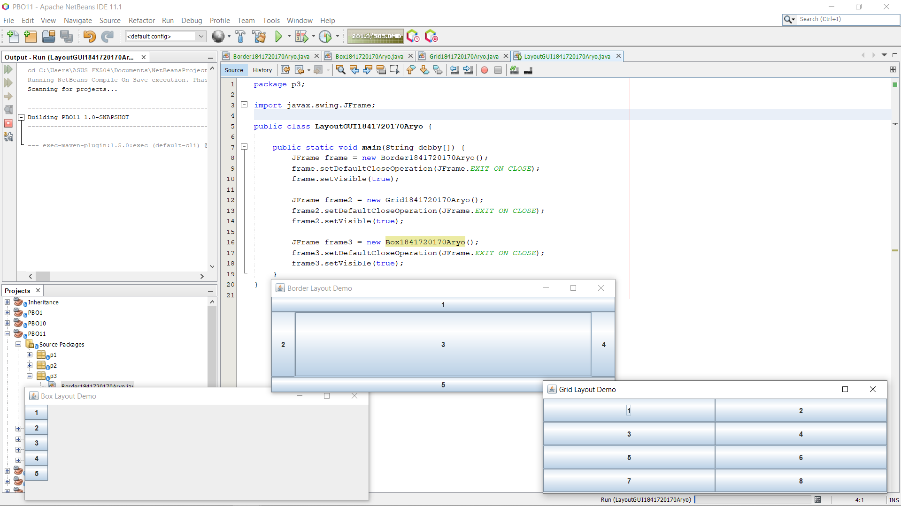
   link kode program :[LayoutGUI](../../src/11_GUI/p3/LayoutGui1841720170Aryo.java)

<h2> Pertanyaan </h2>

1. Apa perbedaan dari Grid Layout, Box Layout dan Border Layout?
- Class Grid menampilkan angka menggunakan tata letak kanan dan kiri.
- Class Box menampilkan angka pad box masing2 menggunakan tata letak horizontal.
- Class Border menampilkan angka sesuai dengan border yang ditentukan.

2. Apakah fungsi dari masing-masing kode berikut?
- Menampilkan class yang sudah dibuat.

<h2> Percobaan 4: Membuat GUI Melalui IDE Netbeans </h2>

1. JFrame Form Swing : 
  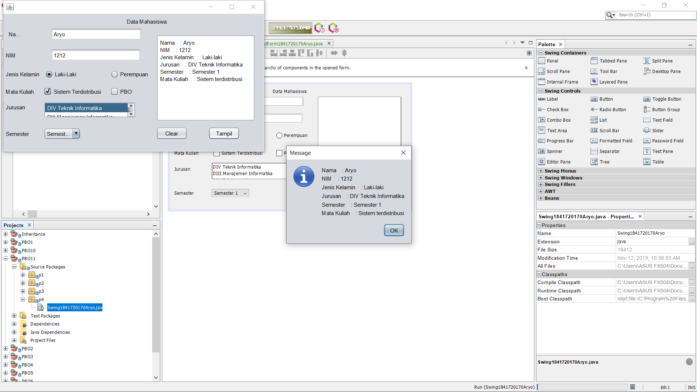

<h2>Pertanyaan</h2>

1. Apakah fungsi dari kode berikut?
- Menampilkan JFrame Form

2. Mengapa pada bagian logika checkbox dan radio button digunakan multiple if ?
- Multiple if berfungsi sebagai pengecekan checkbox diisi atau tidak.

3. Lakukan modifikasi pada program untuk melakukan menambahkan inputan berupa alamat dan berikan fungsi pemeriksaan pada nilai Alamat tersebut jika belum diisi dengan menampilkan pesan peringatan
  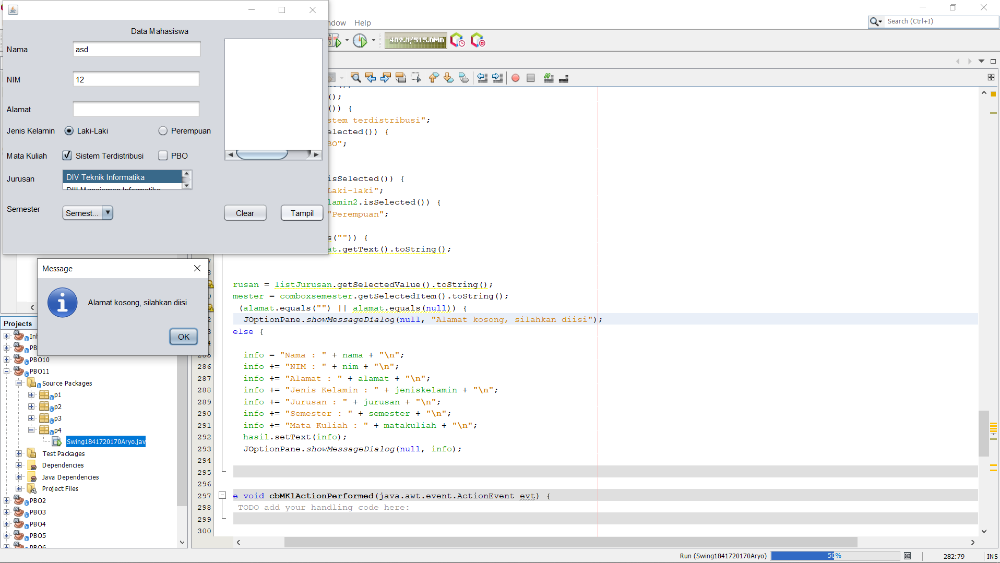
   link kode program :[Swing Form](../../src/11_GUI/p3/Swing1841720170Aryo.form)
   link kode program :[Swing Java](../../src/11_GUI/p3/Swing1841720170Aryo.java)

 Swing1841720170Aryo

<h2> Percobaan 5: JTabPane, JTtree, JTable </h2>

## <h1>Kesimpulan

## <h1>Pernyataan Diri

Saya menyatakan isi tugas, kode program, dan laporan praktikum ini dibuat oleh saya sendiri. Saya tidak melakukan plagiasi, kecurangan, menyalin/menggandakan milik orang lain.

Jika saya melakukan plagiasi, kecurangan, atau melanggar hak kekayaan intelektual, saya siap untuk mendapat sanksi atau hukuman sesuai peraturan perundang-undangan yang berlaku.

Ttd,

Aryo Satyo Wandowo Adi - 05

