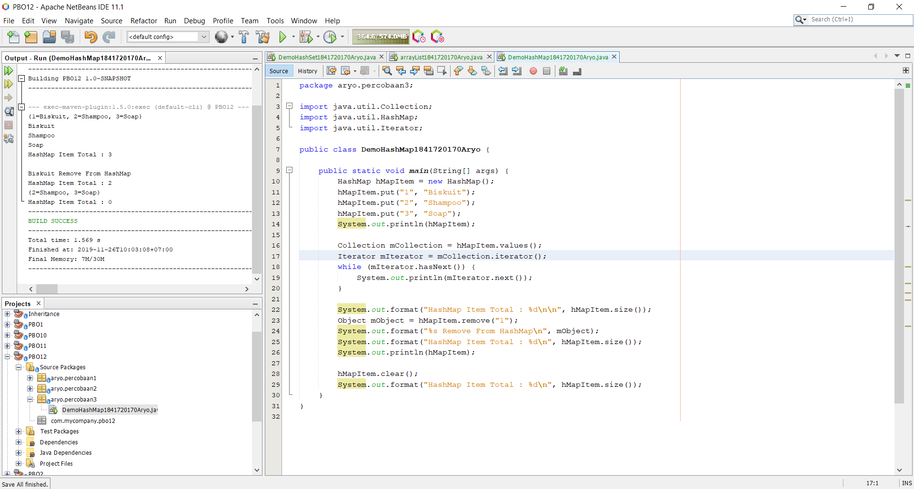

# Laporan Praktikum #12 - JAVA API

## <h1>Kompetensi

- Memahami cara penyimpanan objek menggunakan Collection dan Map.
- Mengetahui pengelompokan dari Collection.
- Mengetahui perbedaan dari interface Set, List dan Map.
- Mengetahui penggunaan class-class dari interface Set, List, dan Map.
- Memahami koneksi database menggunakan JDBC dan JDBC API

## <h1>Ringkasan Materi

- Collection adalah suatu objek yang bisa digunakan untuk menyimpan sekumpulan objek. Objek yang ada dalam Collection disebut elemen.

- Set mengikuti model himpunan, dimana objek/anggota yang tersimpan dalam Set harus unik. Urutan maupun letak dari anggota tidak penting, hanya keberadaan anggota saja yang penting. 

- HashSet dapat digunakan untuk menyimpan elemen-elemen bebas-duplikat.

- List digunakan untuk menyimpan sekumpulan objek berdasarkan urutan masuk (ordered) dan menerima duplikat.

- ArrayList digunakan untuk membuat array yang ukurannya dinamis. Berbeda dengan array biasa yang ukurannya harus ditentukan di awal deklarasi array, dengan ArrayList, ukurannya akan fleksibel tergantung banyaknya elemen yang dimasukkan.

- Perbedaaan mendasar map dengan collection yang lain, untuk menyimpan objek pada Map, perlu sepasang objek, yaitu key yang bersifat unik dan nilai yang disimpan. 

- HashMap adalah class implementasi dar Map, Map itu sendiri adalah interface yang memiliki fungsi untuk memetakan nilai dengan key unik.

- JDBC API merupakan Java Database Connectivity Application Programming Interface (JDBC API). Pada dasarnya JDBC API terdiri dari satu set kelas dan interface yang digunakan untuk berinteraksi dengan database dari aplikasi Java.

### <h1>Praktikum

<h2>Percobaan 1 (Set)</h2>

A. Langkah Percobaan (HashSet)
1. Bukalah program Netbeans IDE yang sudah terinstal dikomputer anda!
2. Buatlah project baru dengan nama JavaApi, ilustrasi project dapat dilihat pada gambar
dibawah ini:
3. Setelah itu buatlah package dengan nama identifier.percobaan1, misalnya : arie.percobaan1.
4. Pada package tersebut buatlah java class dengan nama DemoHashSet.
5. Tambahkan source code yang ada di method main() kedalam class yang sudah anda buat!
  
   link kode program :[DemoHashSet1841720170Aryo](../../src/12_Java_API/percobaan1/DemoHashSet1841720170Aryo.java)

6. Jalankan program diatas, dan amati apa yang terjadi!

<h2>Pertanyaan</h2>

1. Apakah fungsi import java.util.*; pada program diatas!

- Import all class in java.

2. Pada baris program keberapakah yang berfungsi untuk menciptakan object HashSet?
- pada baris 10 : 
 

3. Apakah fungsi potongan program dibawah ini pada percobaan 1!

- Untuk menambahkan objek di hashSet().

4. Tambahkan set.add(“Malang”); kemudian jalankan program! Amati hasilnya dan jelaskan
mengapa terjadi error!

- Error, karena seharusnya objek yang ditambahkan menggunakan parameter mSetCity.

5. Jelaskan fungsi potongan program dibawah ini pada percobaan 1!

- Digunakan unutk mengakses dan menampilkan nilai beserta tambahan methon lain yang didefinisikan dalam interface iterator.

<h2>Percobaan 2 (List)</h2>

A. Langkah Percobaan (ArrayList)
1. Buatlah package dengan nama identifier.percobaan2 pada project yang sudah anda buat
sebelumnya, misalnya : arie.percobaan2.

2. Tambahkan source code berikut pada class yang sudah anda buat!
 
  link kode program :[arrayList1841720170Aryo](../../src/12_Java_API/percobaan2/arrayList1841720170Aryo.java)

3. Jalankan program diatas!

<h2>Pertanyaan</h2>

1. Apakah fungsi potongan program dibawah ini!

- Untuk menampilkan nilai dari mListCountry dari index 0 dan 2.

2. Ganti potongan program pada soal no 1 menjadi sebagai berikut
 

3. Jelaskan perbedaan menampilkan data pada ArrayList menggunakan potongan program pada soal no 1 dan no 2!

- Ketika menggunakan code no.1 maka akan menampilkan data dengan list, sedangkan ketika menggunakan code no.2 akan menampilkan data dengan iterator.

<h2>Percobaan 3 (Map)</h2>

A. Langkah Percobaan
1. Buatlah package dengan nama identifier.percobaan3 pada project yang sudah anda buat
sebelumnya, misalnya : arie.percobaan3.
2. Buatlah class baru dengan nama DemoHashMap. Tambahkan source code dibawah ini
kedalam class!
 

3. Jalankan program diatas, maka outputnya adalah sebagai berikut:
 
  link kode program :[DemoHashMap1841720170Aryo](../../src/12_Java_API/percobaan3/DemoHashMap1841720170Aryo.java)

<h2>Pertanyaan</h2>

1. Jelaskan fungsi hMapItem.put("1","Biskuit") pada program!

- Menambahkan objek 1 dengan nama biskuit di dalam objek hMapItem pada hashMap().

2. Jelaskan fungsi hMapItem.size() pada program!

- Menampilkan size / banyak data.

3. Jelaskan fungsi hMapItem.remove("1") pada program!

- Menghapus item yang '1'.

4. Jelaskan fungsi hMapItem.clear() pada program!

- Menghapus semua data pada hMapItem.

5. Tambahkan kode program yang di blok pada program yang sudah anda buat!
 

6. Jalankan program dan amati apa yang terjadi!
 

7. Apakah perbedaan program sebelumnya dan setelah ditambahkan kode program pada soal no 5 diatas? Jelaskan!

- Hanya output yang berubah, ketika ditambahkan code  pertanyaan no.5 output akan tampil dengan menggunakan iterator.

<h2>Percobaan 4 (Implementasi ArrayList dalam GUI)</h2>

1. Buatlah package dengan nama identifier.percobaan4 pada project yang sudah anda buat sebelumnya, misalnya : arie.percobaan4.

2. Buatlah class baru dengan nama Mahasiswa

3. Deklarasikan atribut Nim,Nama, Alamat dengan acces modifier private dan bertipe data String pada class Mahasiswa yang sudah dibuat
 

4. Buatlah kontruktor pada class Mahasiswa sebagai berikut:
 

5. Buatlah method getNim(),getNama(), dan getAlamat()
 
  link kode program :[Mahasiswa1841720170Aryo](../../src/12_Java_API/percobaan4/Mahasiswa1841720170Aryo.java)

6. Buatlah class baru dengan nama InputData
  link kode program :[InputData1841720170Aryo](../../src/12_Java_API/percobaan4/InputData1841720170Aryo.java)

7. Lakukan import ArrayList dengan menambahkan import java.util.ArrayList;

8. Buatlah ArrayList dengan nama ListMahasiswa dari class Mahasiswa
 

9. Buatlah kontruktor dari class InputData kemudian isi kontruktor tersebut dengan inisialisasi dari ArrayList ListMahasiswa yang sudah anda deklarasikan sebelumnya
 

10. Buatlah method isi data sebagai berikut:
 

11. Buatlah method getData() untuk mengambil seleuruh data yan ada pada ListMahasiswa
 

12. Buatlah class Jframe baru dengan nama TampilGui kemudian buat desain sebagai berikut:
 

13. Tambahkan
 

14. Deklarasikan DeafultTableModel sebagai TabBuku

15. Kemudian buatlah objek dari class InputData

16. Inisialisasi objek DataMahasiswa dari class Input Data didalam kontruktor TampilGui()

17. Buatlah method LihatDataMahasiswa()
 

18. Panggil method LihatDataMahasiswa() yang sudah dibuat didalam kontruktor TampilGui()
 

19. Double klik pada Button Simpan kemudian tambahkan kode berikut:
 

20. Jalankan program
 

21. Tambahkan data berikut kemudian klik simpan
 

22. Maka data akan tersimpan pada Jtable
 
  link kode program :[TampilGui1841720170Aryo](../../src/12_Java_API/percobaan4/TampilGui1841720170Aryo.java)
  link kode program :[TampilGui1841720170Aryo](../../src/12_Java_API/percobaan4/TampilGui1841720170Aryo.form)

## <h1>Kesimpulan

Pengertian API (Application Programming Interface)
Antarmuka pemrograman aplikasi (Application Programming Interface/API) adalah sekumpulan perintah, fungsi, dan protocol yang dapat digunakan oleh programmer saat membangun perangkat lunak untuk system operasi tertentu. API memungkinkan programmer untuk menggunakan fungsi standar untuk berinteraksi dengan system operasi.

## <h1>Pernyataan Diri

Saya menyatakan isi tugas, kode program, dan laporan praktikum ini dibuat oleh saya sendiri. Saya tidak melakukan plagiasi, kecurangan, menyalin/menggandakan milik orang lain.

Jika saya melakukan plagiasi, kecurangan, atau melanggar hak kekayaan intelektual, saya siap untuk mendapat sanksi atau hukuman sesuai peraturan perundang-undangan yang berlaku.

Ttd,

Aryo Satyo Wandowo Adi - 05

