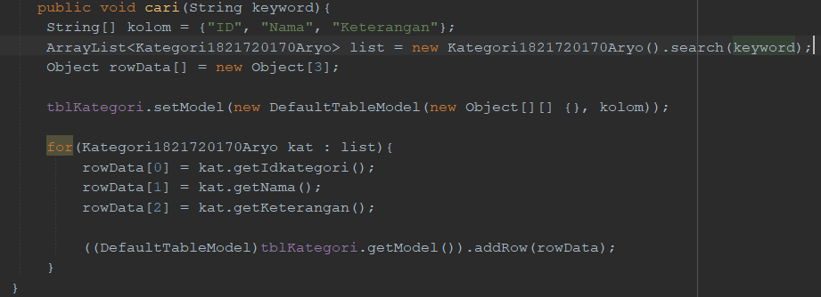
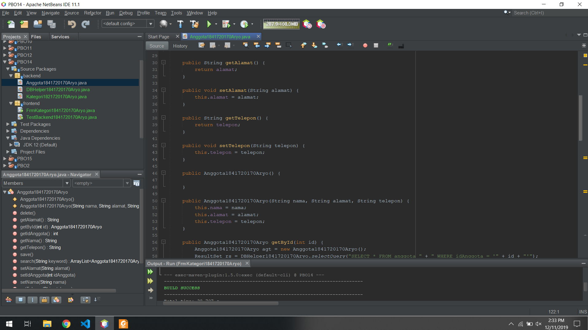
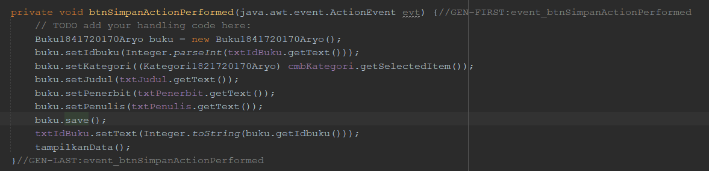

# Laporan Praktikum #14 - GUI DAN DATABASE

## <h1>Kompetensi

Setelah menempuh materi percobaan ini, mahasiswa mampu mengenal:
1. Menggunakan paradigma berorientasi objek untuk interaksi dengan database
2. Membuat backend dan frontend
3. Membuat form sebagai frontend

## <h1>Ringkasan Materi

### <h1>Praktikum

### Percobaan 1

Membuat database.

1. Langkah pertama untuk percobaan ini adalah membuat database. Install XAMPP, buka
phpMyAdmin, buat database dbperpus, dan tabel-tabelnya:
 

Set semua primary key id pada tiap tabel (idanggota, idkategori, idpeminjaman, idbuku) dengan
Auto Increment.

### Percobaan 2

1. Buat project baru, beri nama Perpustakaan.
2. Pada project explorer, klik kanan pada Libraries → Add Library, pilih MySQL JDBC Driver.
3. Buat package frontend dan backend. Cara membuat package adalah, pada project explorer, klik
kanan pada Source Packages → New → Java Package, beri nama package nya (frontend,
backend).
 

### Percobaan 3

1. Pada package backend, buat class DBHelper.

2. Import java.sql.*
 

3. Didalam class ini ada method-method antara lain:
 a. bukaKoneksi(), untuk membuka koneksi ke database
 
 b. insertQueryGetId(String query), untuk melakukan insert ke tabel dan mengembalikan
nilai ID yang digenerate oleh database (hasil Auto Increment).
 
 c. executeQuery(String query), untuk mengeksekusi query yang tidak mengembalikan nilai
(misal: insert, update, delete).
 d. selectQuery(String query), untuk mengeksekusi select query yang mengembalikan nilai
hasil query.
 

4. Berikut adalah kode dari class DBHelper. Anda perlu sesuaikan method bukaKoneksi() dengan
setting database yang terinstall di sistem anda. Namun jika anda install XAMPP secara default,
maka setting ini tidak perlu diubah, mungkin nama database saja yang perlu disesuaikan.
Silahkan COPAS kode berikut ini.

### Percobaan 4

1. Pada package backend, buat class baru yaitu Kategori.

2. Tambahkan import java.util.ArrayList dan java.sql.*
 

3. Tambahkan atribut sesuai field pada tabel kategori.
 

4. Tambahkan getter setter untuk setiap atribut. Anda bisa gunakan fasilitas Insert Code pada
NetBeans. Caranya adalah, klik kanan sembarang tempat di editor, pilih Insert Code, pilih Setter
and Getter, centang semua atribut yang ada (idkategori, nama, keterangan).
 

5. Tambahkan konstruktor default dan konstruktor custom, yang digunakan untuk mengeset
atribut nama dan keterangan. Atribut idkategori tidak boleh diset, karena id ini akan digenerate
secara otomatis lewat fitur AutoIncrement pada MySQL.
 

6. Tambahkan method getById() untuk mendapatkan objek Kategori yang ada di database
berdasarkan id-nya.
 

7. Tambahkan method getAll() untuk mendapatkan semua data Kategori yang ada di database, dan
ditampung ke ArrayList<Kategori>.
 

8. Tambahkan method search() agar bisa melakukan pencarian data. Method ini mirip dengan
method getAll() namun querynya berbeda.
 

9. Tambahkan method save(). Method ini memiliki dua fungsi, yaitu insert dan update. Jika data
yang diinputkan belum ada (idkategori = 0) maka akan otomatis insert. Jika data yang diinputkan
sudah ada, maka otomatis update.
 

10. Tambahkan method delete() untuk melakukan operasi penghapusan pada tabel kategori pada
database.
 

### Percobaan 5

1. Pada package frontend, buat class TestBackend. Tambahkan import backend.*

2. Berikut kode lengkap untuk class TestBackend. Silahkan di COPAS

3. Jalankan TestBackend dengan klik kanan, Run File. Cocokkan outputnya:
 

### Percobaan 6

1. Pada package frontend, buat JFrame dengan nama FrmKategori. Caranya adalah, klik kanan

pada package frontend → New →JFrame Form.
2. Susun form sehingga seperti berikut ini, atur propertinya sesuai nomor:

3. Edit kodenya, tambahkan import backend.*, java.util.ArrayList,
javax.swing.table.DefaultTableModel;
 

4. Tambahkan method kosongkanForm() untuk mengosongkan isian textbox pada form.
 

5. Tambahkan method tampilkanData() untuk mengambil semua data kategori dari database dan
menampilkannya ke JTable tblKategori.
 

6. Tambahkan method cari() untuk melakukan pencarian berdasarkan keyword tertentu.
 

7. Pada konstruktor, tambahkan pemanggilan method kosongkanForm() dan tampilkanData(), agar
ketika form ditampilkan pertama kali, maka form isian akan kosong dan data kategori langsung
ditampilkan.
 

8. Double klik pada btnSimpan untuk menambahkan kode untuk menyimpan data. Aksi
menyimpan ini secara otomatis menentukan apakah insert atau update, karena pada method
save() dari objek kat, sudah dicek apakah data baru atau sudah ada (baca Percobaan 4, no. 9)
 

9. Double klik pada btnHapus untuk menambahkan kode untuk menghapus data.
 

10. Double klik pada btnTambahBaru untuk mengosongkan form sehingga dapat digunakan untuk
menginputkan data baru.
 

11. Double klik pada btnCari untuk melakukan pencarian terhadap keyword yang dimasukkan pada
txtCari.
 

12. Agar kita dapat memilih data yang ada pada tblKategori, agar dapat diedit atau dihapus, maka
kita tambahkan event mouse click pada tblKategori. Ketika pengguna mengklik pada tblKategori,
maka data tersebut akan ditampilkan di tex field. Caranya, klik kanan pada tblKategori, pilih
Events → Mouse → MouseClicked. Tambahkan kode berikut ini:
 

13. Jalankan form dengan opsi Run File. Kemudian ujicoba tambah baru, edit, hapus, cari.
 

### Percobaan 7

1. Buat class Anggota pada package backend, lengkapi atribut dan method-nya.
 
 
 
 
 

2. Lakukan test pada class TestBackend pada package frontend.
 

### Percobaan 8

Buat form untuk data Anggota.

1. Buat FrmAnggota pada package frontend dan lengkapi komponen, method serta event-nya.
 

### Percobaan 9
Untuk data Buku, caranya kurang lebih sama seperti data Kategori dan Anggota. Hanya saja yang
berbeda adalah:

 a. Pemanggilan getKategori().getIdKategori() pada query insert dan update untuk mengeset idkategori pada tabel buku
 b. Query select yang melibatkan join table pada method getById(), getAll() dan search().

 
 
 

 Kode lengkap class Buku dapat anda lihat di Lampiran 1. Untuk test buku pada frontend, bisa anda
lihat di Lampiran 2.

### Percobaan 10
Membuat GUI untuk data Buku, yang dilengkapi dengan combo box untuk memilih kategori yang
terhubung dengan tabel kategori.

1. Pada package frontend, buat jFrame FrmBuku. Susun formnya sebagai berikut:

2. Edit kodenya, tambahkan import backend.*, java.util.ArrayList,
javax.swing.table.DefaultTableModel, javax.swing.DefaultComboBoxModel;
 

3. Tambahkan method kosongkanForm() untuk mengosongkan isian textbox pada form.
 

4. Tambahkan method tampilkanData() untuk mengambil semua data buku dari database dan
menampilkannya ke JTable tblBuku.
 

5. Tambahkan method cari() untuk melakukan pencarian berdasarkan keyword tertentu.
 

6. Tambahkan method tampilkanCmbKategori() untuk mengambil data Kategori dari database dan
menampilkannya ke cmbKategori.
 

7. Pada konstruktor, tambahkan pemanggilan method kosongkanForm(), tampilkanCmbKategori()
dan tampilkanData(), agar ketika form ditampilkan pertama kali, maka form isian akan kosong
dan data buku langsung ditampilkan.
 

8. Double klik pada btnSimpan untuk menambahkan kode untuk menyimpan data. Aksi
menyimpan ini secara otomatis menentukan apakah insert atau update, karena pada method
save() dari objek kat, sudah dicek apakah data baru atau sudah ada (baca Percobaan 4, no. 9)
 

9. Double klik pada btnHapus untuk menambahkan kode untuk menghapus data.
 

10. Double klik pada btnTambahBaru untuk mengosongkan form sehingga dapat digunakan untuk
menginputkan data baru.
 

11. Double klik pada btnCari untuk melakukan pencarian terhadap keyword yang dimasukkan pada
txtCari.
 

12. Agar kita dapat memilih data yang ada pada tblBuku, agar dapat ditampilkan di textfield untuk
diedit atau dihapus, maka kita tambahkan event mouse click pada tblKategori. Caranya, klik
kanan pada tblBuku, pilih Events → Mouse → MouseClicked. Tambahkan kode berikut ini:
 

13. Jalankan form dengan opsi Run File. Kemudian ujicoba tambah baru, edit, hapus, cari
 

## <h1>Kesimpulan

## <h1>Pernyataan Diri

Saya menyatakan isi tugas, kode program, dan laporan praktikum ini dibuat oleh saya sendiri. Saya tidak melakukan plagiasi, kecurangan, menyalin/menggandakan milik orang lain.

Jika saya melakukan plagiasi, kecurangan, atau melanggar hak kekayaan intelektual, saya siap untuk mendapat sanksi atau hukuman sesuai peraturan perundang-undangan yang berlaku.

Ttd,

Aryo Satyo Wandowo Adi - 05

Link kode program :[FormKoneksi1841720170Aryo](../../src/12_Java_API/percobaan5/FormKoneksi1841720170Aryo.form)
  Link kode program :[FormKoneksi1841720170Aryo](../../src/12_Java_API/percobaan5/FormKoneksi1841720170Aryo.java)