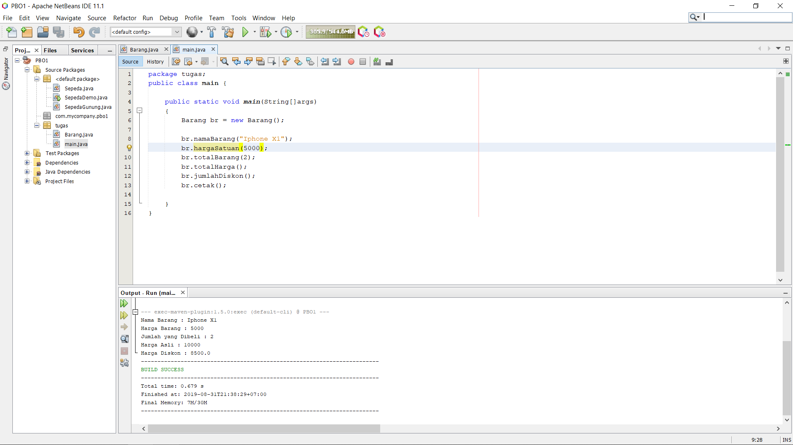

# Laporan Praktikum #1 - Pengantar Konsep PBO

## Kompetensi

-

## Ringkasan Materi

-

## Percobaan

### Percobaan 1

### Percobaan 2

link kode program : (../laporan-praktikum-pbo/src/1_Pengantar_Konsep_PBO/Sepeda.java)
link kode program : (../../src/1_Pengantar_Konsep_PBO/SepedaDemo.java)
link kode program : (../../src/1_Pengantar_Konsep_PBO/SepedaGunung.java)

## Pertanyaan

 1. Sebutkan dan jelaskan aspek-aspek yang ada pada pemrograman berorientasi objek!

 		- Class : Merupakan kumpulan atas definisi data dan fungsi-fungsi dalam suatu unit untuk suatu tujuan tertentu. 

 		- Objek : Membungkus data dan fungsi bersama menjadi suatu unit dalam sebuah program komputer

 	 	- Enkapsulasi : Sebuah objek tidak dapat mengganti keadaan dalam dari sebuah objek dengan cara yang tidak layak hanya metode dalam objek tersebut yang diberi izin untuk mengakses keadaannya biasanya disebut pewarisan

 		- Abstraksi : Merupakan hierarki tertinggi dari sub-sub class-nya. Kelas abstrak digunakan untuk membuat sebuah kelas yang memiliki method yang belum jelas implementasinya 

 		- Inheritance : Sebuah objek dapat mempunyai objek turunan. Dalam hal pemrogramman makan dapat diimpelementasikan dengan sebuah class yang mempunyai class turunan. Class yang mempunyai class turunan disebut sebagai Parent Class, sedangkan class yang menjadi turunan dari Parent Class disebut sebagai Subclass atau Child Class.

 		- Polimorfisme : Ketika sebuah program memanggil sebuah method melalui sebuah variabel kelas induk (superclass), kelas turunan (subkelas) yang sesuai dari method itu dipanggil, berdasarkan pada tipe tersebut disimpan di dalam variabel kelas induk (superclass)

 2. Apa yang dimaksud dengan object dan apa bedanya dengan class?

 	- Class merupakan kumpulan dari suatu fungsi yang dibuat untuk suatu tujuan tertentu misalkan kita membuat class sepeda maka di didalam class tersebut terdapat fungsi yang membuat sepeda tersebut berfungsi

 	- Object merupakan pemanfaatan dari class yang sudah siap digunakan, misalkan kita sudah membuat class sepeda, maka sepeda tersebut harus sudah berfungsi. maka sepeda tersebut bernama object. 

 3. Sebutkan salah satu kelebihan utama dari pemrograman berorientasi objek dibandingkan dengan pemrograman struktural! 

	- Hanya menggunakan 1 class
	- Bisa menambahkan class tanpa mengedit class awal
	- Data yang digunakan private hanya bisa di akses oleh beberapa fungsi

4. Pada class Sepeda, terdapat state/atribut apa saja?

	- gear, merek, kecepatan.

5. Tambahkan atribut warna pada class Sepeda.
	
	-  tambahkan code di class sepeda : 
	public void setWarna(String newValue)
    {
        warna = newValue;
    }

    - lalu tambahkan di class sepedaDemo
    	spd1.setWarna("Merah");
    	spd2.setWarna("Hijau");
    	spd3.setWarna("Kuning");

6. Mengapa pada saat kita membuat class SepedaGunung, kita tidak perlu membuat class nya dari nol?

	- Ini dinamakan inherintance atau pewarisan.

## Tugas

link kode program :(../../src/1_Pengantar_Konsep_PBO/Barang.java)

link kode program :(../../src/1_Pengantar_Konsep_PBO/main.java)

## Kesimpulan

sulit dan saya akan terus mencoba walaupun masi sedikit melihat internet.

## Pernyataan Diri

Saya menyatakan isi tugas, kode program, dan laporan praktikum ini dibuat oleh saya sendiri. Saya tidak melakukan plagiasi, kecurangan, menyalin/menggandakan milik orang lain.

Jika saya melakukan plagiasi, kecurangan, atau melanggar hak kekayaan intelektual, saya siap untuk mendapat sanksi atau hukuman sesuai peraturan perundang-undangan yang berlaku.

Ttd,

Aryo Satyo Wandowo Adi
