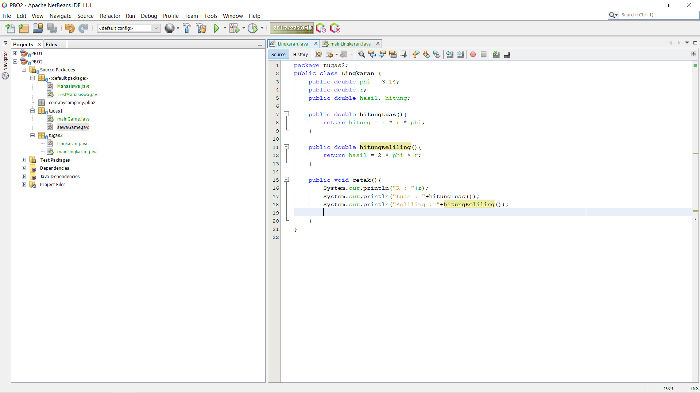

# Laporan Praktikum #2 - Class dan Object

## <h1>Kompetensi

   Mahasiswa dapat memahami deskripsi dari class dan object
  Mahasiswa memahami implementasi dari class
  Mahasiswa dapat memahami implementasi dari attribute
  Mahasiswa dapat memahami implementasi dari method
  Mahasiswa dapat memahami implementasi dari proses instansiasi
  Mahasiswa dapat memahami implementasi dari try-catch
  Mahasiswa dapat memahami proses pemodelan class diagram menggunakan UML

## <h1>Ringkasan Materi

 Pengaplikasian class dan object
 Membuat class diagram dengan UML

## <h1>Percobaan

### Percobaan 1

Studi Kasus 1:
Dalam suatu perusahaan salah satu data yang diolah adalah data karyawan. Setiap
karyawan memiliki id, nama, jenis kelamin, jabatan, jabatan dan gaji. Setiap mahasiswa juga bisa menampilkan data diri pribadi dan melihat gajinya.

1. Gambarkan desain class diagram dari studi kasus 1!,
   

2. Sebutkan Class apa saja yang bisa dibuat dari studi kasus 1!,
-  Karyawan, karena class karyawan bisa mencakup semua data

3. Sebutkan atribut beserta tipe datanya yang dapat diidentifikasi dari masing-masing
class dari studi kasus 1!
- id : int
 nama : String
 jeniskelamin : String
 jabatan : String
 gaji : double

4. Sebutkan method-method yang sudah anda buat dari masing-masing class pada studi
kasus 1!
- cetakStatus():void

### Percobaan 2

1. Bukalah text editor atau IDE, misalnya Notepad ++ / netbeans.

2. Ketikkan kode program berikut ini:
      

3. Simpan dengan nama file Mahasiswa.java.

4. Untuk dapat mengakses anggota-anggota dari suatu obyek, maka harus dibuat instance
dari class tersebut terlebih dahulu. Berikut ini adalah cara pengaksesan anggotaanggota dari class Mahasiswa dengan membuka file baru kemudian ketikkan kode
program berikut:
      
5. Simpan file dengan TestMahasiswa.java

6. Jalankan class TestMahasiswa
      

link kode program :[mahasiswa](../../src/2_Class_dan_Object/mahasiswa.java)
 link kode program :[Mahasiswa Main](../../src/2_Class_dan_Object/testMahasiswa.java)

7. Jelaskan pada bagian mana proses pendeklarasian atribut pada program diatas!

    - Atribut pada class Mahasiswa pada method tampilBiodata. Terdapat atribut nim, nama, alamat, kelas.

8. Jelaskan pada bagian mana proses pendeklarasian method pada program diatas!

    - Pendeklarasian method pada class Mahasiswa ialah tampilbiodata() void

9. Berapa banyak objek yang di instansiasi pada program diatas!

    - Objek terdapat pada class TestMahasiswa pada code : Mahasiswa mhs1 = new Mahasiswa();

10. Apakah yang sebenarnya dilakukan pada sintaks program “mhs1.nim=101” ?

    - Code tersebut mendklarasikan bahwa mahasiswa1 ber-nim : 101

11. Apakah yang sebenarnya dilakukan pada sintaks program “mhs1.tampilBiodata()” ?

    - mhs1 akan mencetak biodata yang mecakup nim, nama, alamat, kelas.

12. Instansiasi 2 objek lagi pada program diatas!

    -   

## <h1>Tugas

1. Suatu toko persewaan video game salah satu yang diolah adalah peminjaman, dimana
data yang dicatat ketika ada orang yang melakukan peminjaman adalah id, nama
member, nama game, dan harga yang harus dibayar. Setiap peminjaman bisa
menampilkan data hasil peminjaman dan harga yang harus dibayar. Buatlah class
diagram pada studi kasus diatas!
Penjelasan:
    - Harga yang harus dibayar diperoleh dari lama sewa x harga.
    - Diasumsikan 1x transaksi peminjaman game yang dipinjam hanya   1 game saja.

      

      

link kode program :[sewaGame](../../src/2_Class_dan_Object/sewaGame.java)
 link kode program :[Main Game](../../src/2_Class_dan_Object/mainGame.java)

2. Buatlah program dari class diagram yang sudah anda buat di no 1!

     

3. Buatlah program sesuai dengan class diagram berikut ini:

     

    <h3>hasil : 

     
     

link kode program :[Lingkaran](../../src/2_Class_dan_Object/Lingkaran.java)
 link kode program :[Main Lingkaran](../../src/2_Class_dan_Object/mainLingkaran.java)

4. Buatlah program sesuai dengan class diagram berikut ini:

     

    <h3>hasil :  

     
     

link kode program :[Barang](../../src/2_Class_dan_Object/Barang.java)
 link kode program :[Main Barang](../../src/2_Class_dan_Object/barangMain.java)

## <h1>Kesimpulan

 Membuat pemodelan class diagram menggunakan uml. 
 Object membantu kita untuk meringkas sebuah code supaya lebih efisien.

## <h1>Pernyataan Diri

Saya menyatakan isi tugas, kode program, dan laporan praktikum ini dibuat oleh saya sendiri. Saya tidak melakukan plagiasi, kecurangan, menyalin/menggandakan milik orang lain.

Jika saya melakukan plagiasi, kecurangan, atau melanggar hak kekayaan intelektual, saya siap untuk mendapat sanksi atau hukuman sesuai peraturan perundang-undangan yang berlaku.

Ttd,

Aryo Satyo Wandowo Adi
