# Laporan Praktikum #3 - Enkapsulasi Pada Pemrograman Berorientasi Objek

## <h1>Kompetensi

 Setelah melakukan percobaan pada modul ini, mahasiswa memahami konsep:
 1. Konstruktor
 2. Akses Modifier
 3. Atribut/method pada class
 4. Intansiasi atribut/method
 5. Setter dan getter
 6. Memahami notasi pada UML Class Diagram

## <h1>Ringkasan Materi
 
-

### <h1>Percobaan 1

  3.1 Percobaan 1 - Enkapsulasi
 Didalam percobaan enkapsulasi, buatlah class Motor yang memiliki atribut kecepatan dan kontakOn,
dan memiliki method printStatus() untuk menampilkan status motor. Seperti berikut
1. Buka Netbeans, buat project MotorEncapsulation.
2. Buat class Motor. Klik kanan pada package motorencapsulation – New – Java Class.
3. Ketikkan kode class Motor dibawah ini.

 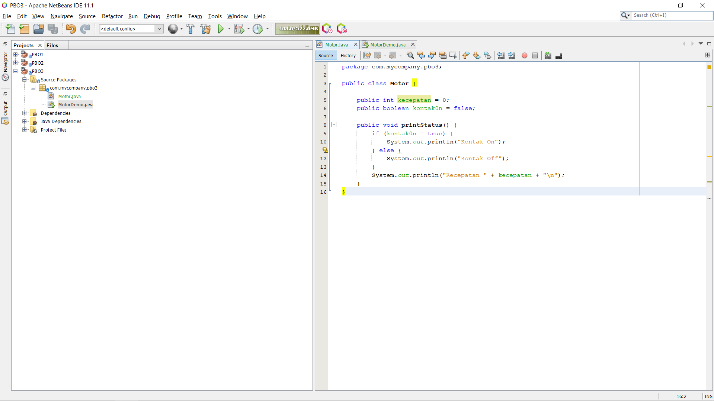

4. Kemudian buat class MotorDemo, ketikkan kode berikut ini
5. Hasilnya adalah sebagai berikut:

 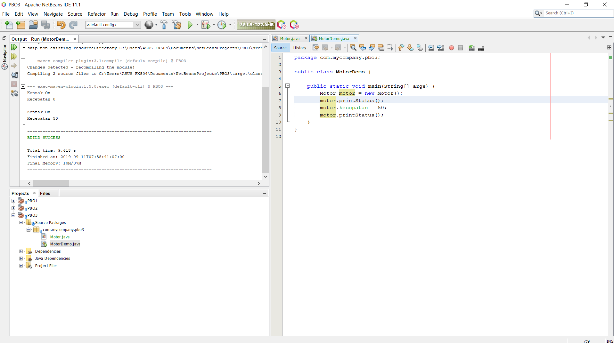

 Dari percobaan 1 - enkapsulasi, menurut anda, adakah yang janggal?
 Yaitu, kecepatan motor tiba-tiba saja berubah dari 0 ke 50. Lebih janggal lagi, posisi kontak motor
masih dalam kondisi OFF. Bagaimana mungkin sebuah motor bisa sekejap berkecepatan dari nol ke
50, dan itupun kunci kontaknya OFF?
  Nah dalam hal ini, akses ke atribut motor ternyata tidak terkontrol. Padahal, objek di dunia nyata
selalu memiliki batasan dan mekanisme bagaimana objek tersebut dapat digunakan. Lalu,
bagaimana kita bisa memperbaiki class Motor diatas agar dapat digunakan dengan baik? Kita bisa
pertimbangkan beberapa hal berikut ini:
 1. Menyembunyikan atribut internal (kecepatan, kontakOn) dari pengguna (class lain)
 2. Menyediakan method khusus untuk mengakses atribut.
Untuk itu mari kita lanjutkan percobaan berikutknya tentang Access Modifier.

### <h1>Percobaan 2

3.2 Percobaan 2 - Access Modifier
Pada percobaan ini akan digunakan access modifier untuk memperbaiki cara kerja class Motor pada
percobaan ke-1.

1. Ubah cara kerja class motor sesuai dengan UML class diagram berikut.
 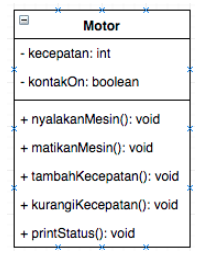

2. Berdasarkan UML class diagram tersebut maka class Motor terdapat perubahan, yaitu:Page 6 of 15
a. Ubah access modifier kecepatan dan kontakOn menjadi private
b. Tambahkan method nyalakanMesin, matikanMesin, tambahKecepatan,
kurangiKecepatan.
 Implementasi class Motor adalah sebagai berikut:
  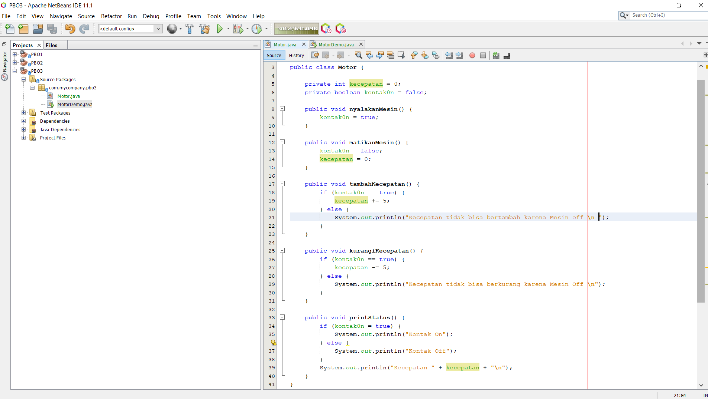

3. Kemudian pada class MotorDemo, ubah code menjadi seperti berikut:
4. Hasilnya dari class MotorDemo adalah sebagai berikut:
  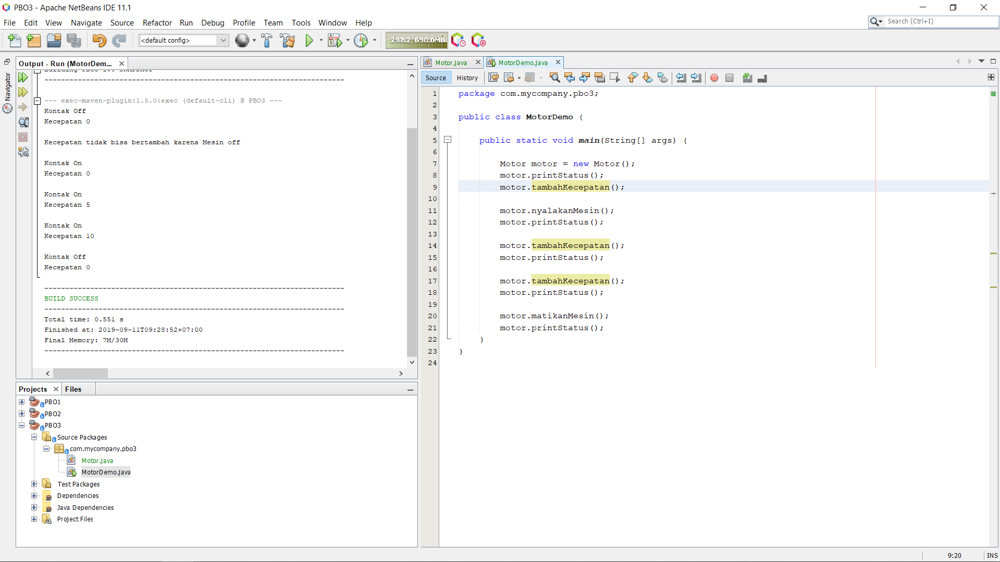

 Dari percobaan diatas, dapat kita amati sekarang atribut kecepatan tidak bisa diakses oleh pengguna
dan diganti nilainya secara sembarangan. Bahkan ketika mencoba menambah kecepatan saat posisi
kontak masih OFF, maka akan muncul notifikasi bahwa mesin OFF. Untuk mendapatkan kecepatanPage 8 of 15
yang diinginkan, maka harus dilakukan secara gradual, yaitu dengan memanggil method
tambahKecepatan() beberapa kali. Hal ini mirip seperti saat kita mengendarai motor.
  3.3 Pertanyaan
  1. Pada class TestMobil, saat kita menambah kecepatan untuk pertama kalinya, mengapa
muncul peringatan “Kecepatan tidak bisa bertambah karena Mesin Off!”?
 2. Mengapat atribut kecepatan dan kontakOn diset private?
 3. Ubah class Motor sehingga kecepatan maksimalnya adalah 100!

### <h1>Percobaan 3

3.4 Percobaan 3 - Getter dan Sette

Misalkan di sebuah sistem informasi koperasi, terdapat class Anggota. Anggota memiliki atribut
nama, alamat dan simpanan, dan method setter, getter dan setor dan pinjam. Semua atribut pada
anggota tidak boleh diubah sembarangan, melainkan hanya dapat diubah melalui method setter,
getter, setor dan tarik. Khusus untuk atribut simpanan tidak terdapat setter karena simpanan akan
bertambah ketika melakukan transaksi setor dan akan berkurang ketika melakukan
peminjaman/tarik.

  1. Berikut ini UML class buatlah class Mahasiswa pada program:

 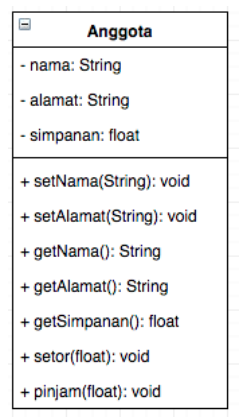

 2. Sama dengan percobaan 1 untuk membuat project baru
 a. Buka Netbeans, buat project KoperasiGetterSetter.
 b. Buat class Anggota. Klik kanan pada package koperasigettersetter – New – Java Class.
 c. Ketikkan kode class Anggota dibawah ini.

 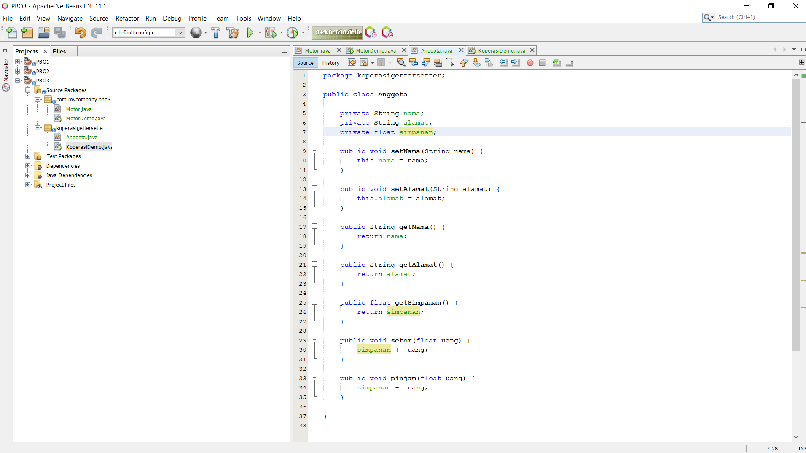
Jika diperhatikan pada class Anggota, atribut nama dan alamat memili masing-masing 1 getter dan setter. Sedangkan atribut simpanan hanya memiliki getSimpanan() saja, karena
seperti tujuan awal, atribut simpanan akan berubah nilainya jika melakukan transaksi setor() dan pinjam/tarik().

3. Selanjutnya buatlah class KoperasiDemo untuk mencoba class Anggota.
4. Hasil dari main method pada langkah ketiga adalah : 

 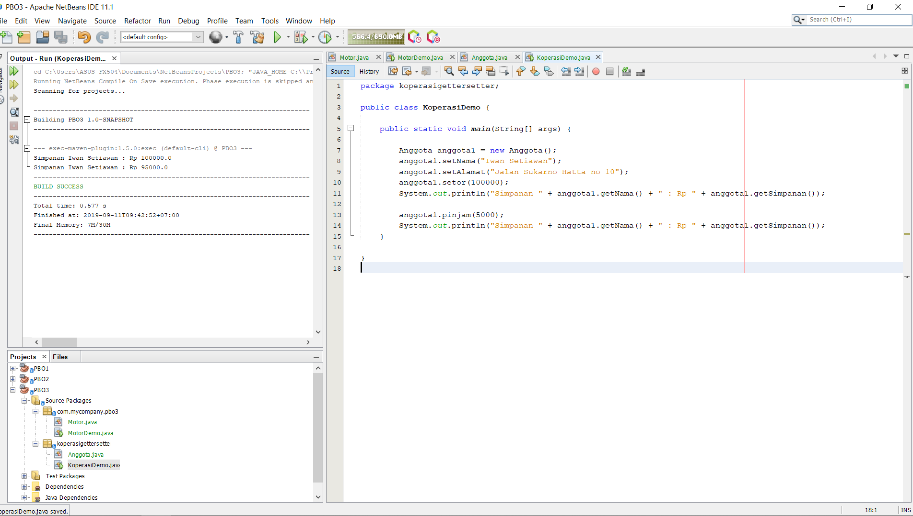

Dapat dilihat pada hasil percobaan diatas, untuk mengubah simpanan tidak dilakukan secara
langsung dengan mengubah atribut simpanan, melainkan melalui method setor() dan pinjam().
Untuk menampilkan nama pun harus melalui method getNama(), dan untuk menampilkan simpanan
melalui getSimpanan().

### <h1>Percobaan 4 

3.5 Percobaan 4 - Konstruktor, Instansiasi

1. Langkah pertama percobaan 4 adalah ubah class KoperasiDemo seperti berikut

2. Hasil dari program tersebut adalah sebagai berikut

 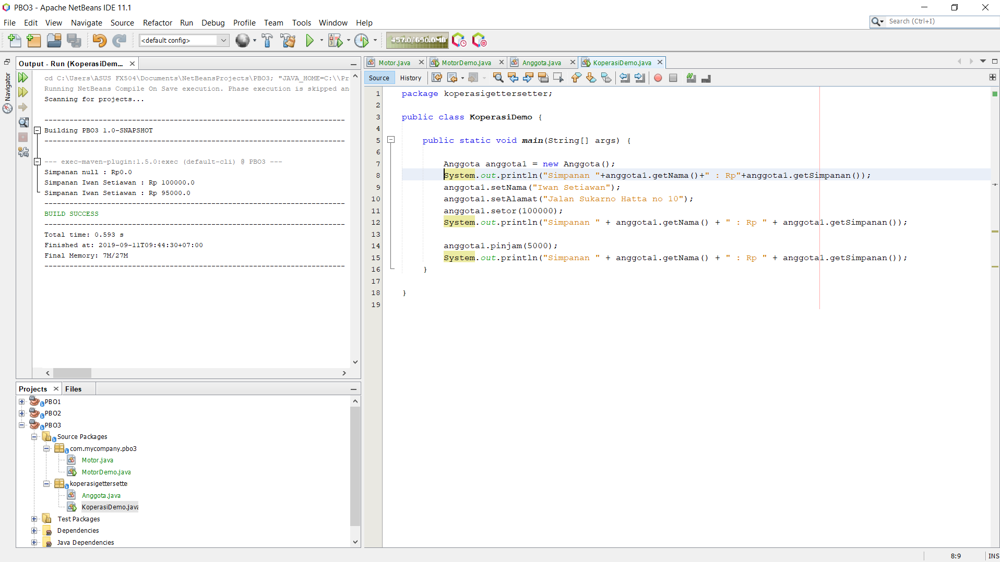

Dapat dilihat hasil running program, ketika dilakukan pemanggilan method getNama()
hasilnya hal ini terjadi karena atribut nama belum diset nilai defaultnya. Hal ini dapat
ditangani dengan membuat kontruktor.

3. Ubah class Anggota menjadi seperti berikut

 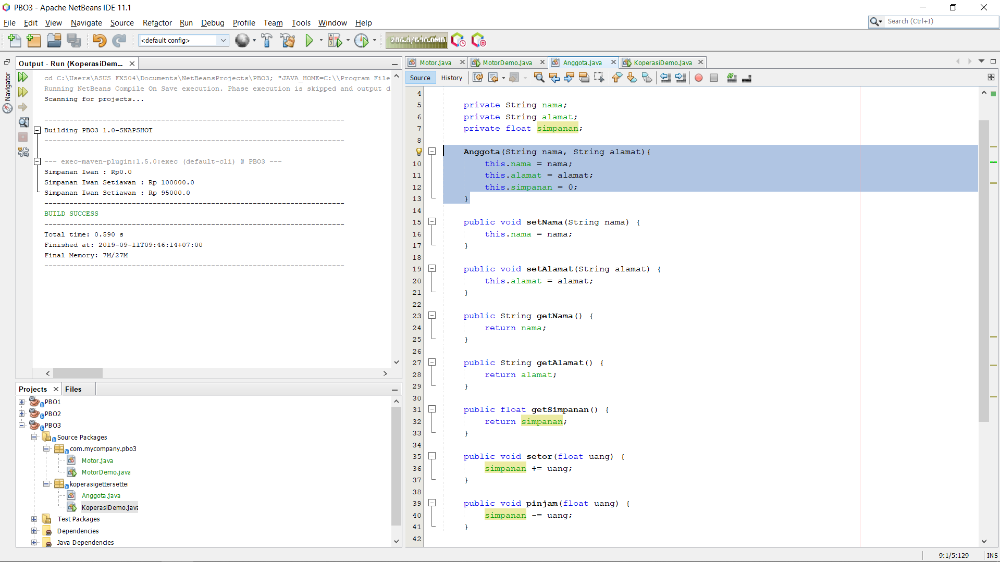

4. Selanjutnya ubah class KoperasiDemo sebagai berikut

5. Hasil dari program tersebut adalah sebagai berikut

 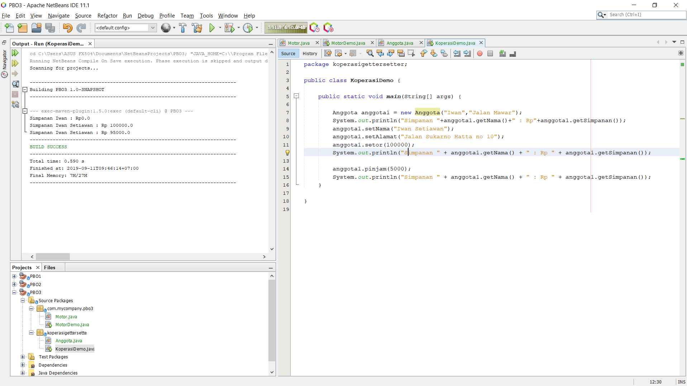

 <h3>3.6 Pertanyaan – Percobaan 3 dan 4</h3>
 1. Apa yang dimaksud getter dan setter?
 2. Apa kegunaan dari method getSimpanan()?
 3. Method apa yang digunakan untk menambah saldo?
 4. Apa yand dimaksud konstruktor?
 5. Sebutkan aturan dalam membuat konstruktor?
 6. Apakah boleh konstruktor bertipe private?
 7. Kapan menggunakan parameter dengan passsing parameter?
 8. Apa perbedaan atribut class dan instansiasi atribut?
 9. Apa perbedaan class method dan instansiasi method?

### <h1> TUGAS

1. Cobalah program dibawah ini dan tuliskan hasil outputnya

 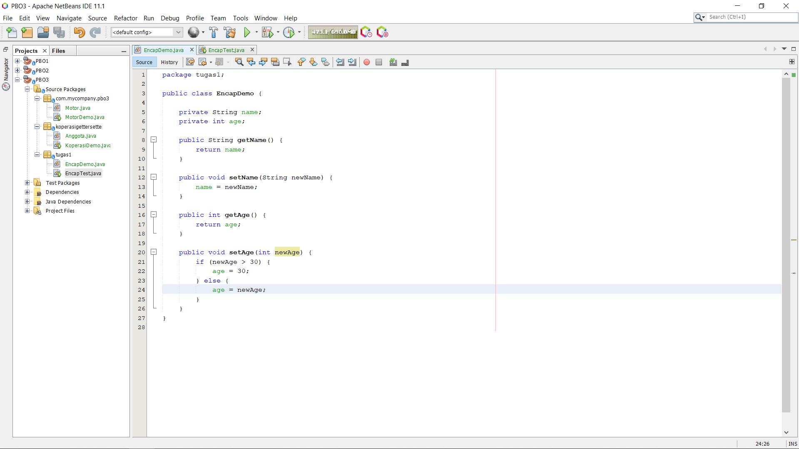
 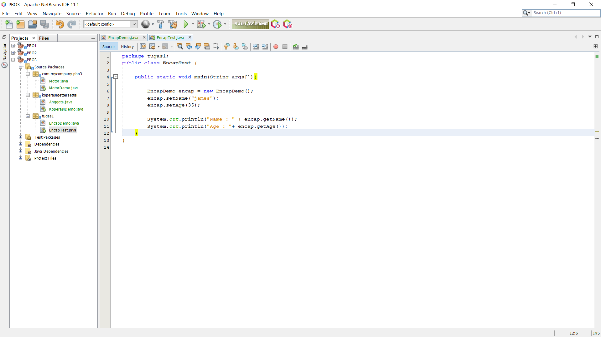

2. Pada program diatas, pada class EncapTest kita mengeset age dengan nilai 35, namun pada
saat ditampilkan ke layar nilainya 30, jelaskan mengapa.

    - Dikarenakan pada method setAge sudah di set bahwa ketika newAge diatas 30 maka otomatis age menjadi 30. 

3. Ubah program diatas agar atribut age dapat diberi nilai maksimal 30 dan minimal 18.

    -  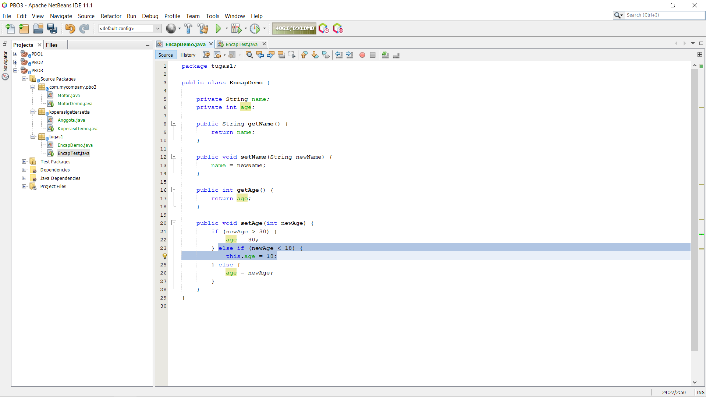

4. Pada sebuah sistem informasi koperasi simpan pinjam, terdapat class Anggota yang memiliki atribut antara lain nomor KTP, nama, limit peminjaman, dan jumlah pinjaman. Anggota dapat meminjam uang dengan batas limit peminjaman yang ditentukan. Anggota juga dapat
mengangsur pinjaman. Ketika Anggota tersebut mengangsur pinjaman, maka jumlah pinjaman akan berkurang sesuai dengan nominal yang diangsur. Buatlah class Anggota tersebut, berikan atribut, method dan konstruktor sesuai dengan kebutuhan. Uji dengan TestKoperasi berikut ini untuk memeriksa apakah class Anggota yang anda buat telah sesuai dengan yang diharapkan.
    -  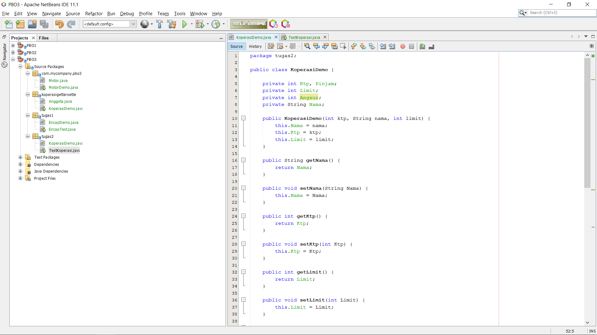
    -  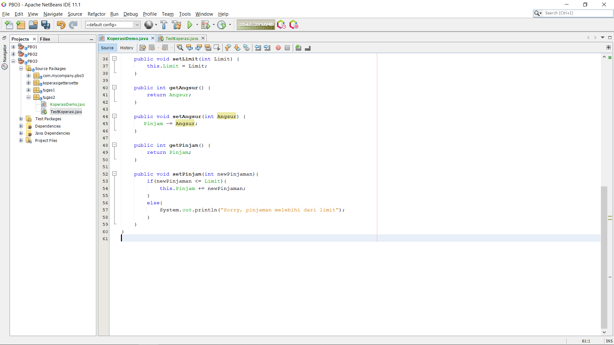
    -  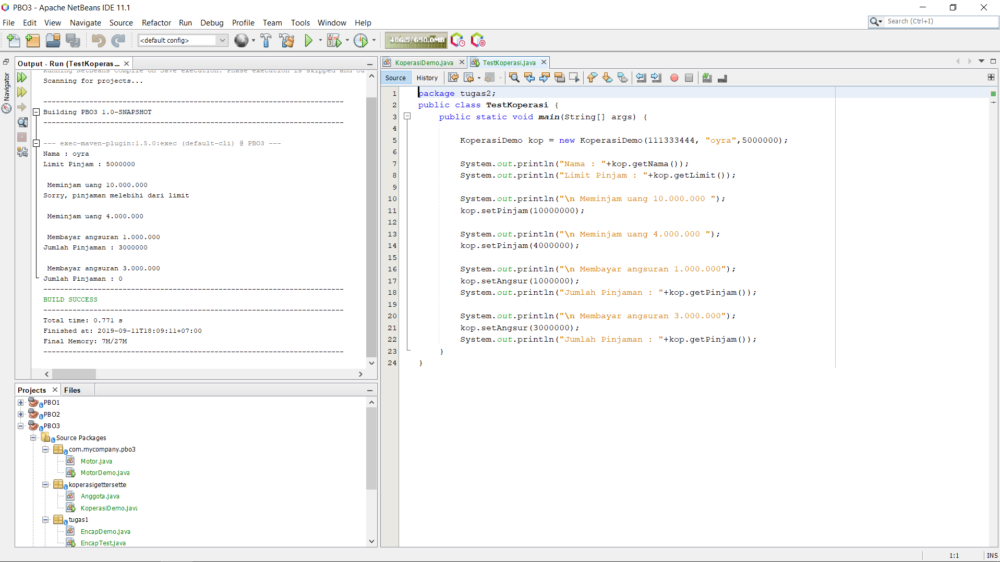

5. Modifikasi soal no. 4 agar nominal yang dapat diangsur minimal adalah 10% dari jumlah pinjaman saat ini. Jika mengangsur kurang dari itu, maka muncul peringatan “Maaf, angsuran harus 10% dari jumlah pinjaman”.
    -  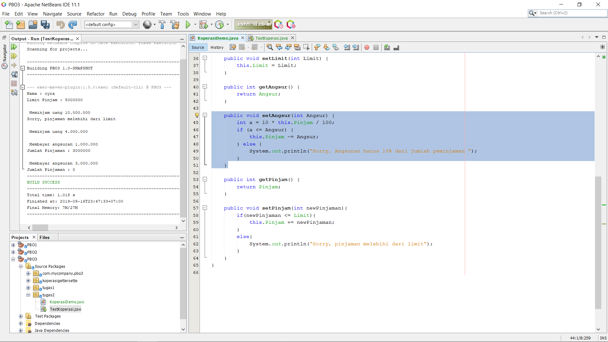

6. Modifikasi class TestKoperasi, agar jumlah pinjaman dan angsuran dapat menerima input
dari console
    - 

## <h1>Kesimpulan
Membuat pemodelan class diagram menggunakan uml. 
 Object membantu kita untuk meringkas sebuah code supaya lebih efisien.

## <h1>Pernyataan Diri

Saya menyatakan isi tugas, kode program, dan laporan praktikum ini dibuat oleh saya sendiri. Saya tidak melakukan plagiasi, kecurangan, menyalin/menggandakan milik orang lain.

Jika saya melakukan plagiasi, kecurangan, atau melanggar hak kekayaan intelektual, saya siap untuk mendapat sanksi atau hukuman sesuai peraturan perundang-undangan yang berlaku.

Ttd,

Aryo Satyo Wandowo Adi - 05

link kode program :[Barang](../../src/2_Class_dan_Object/Barang.java)
 link kode program :[Main Barang](../../src/2_Class_dan_Object/barangMain.java)
