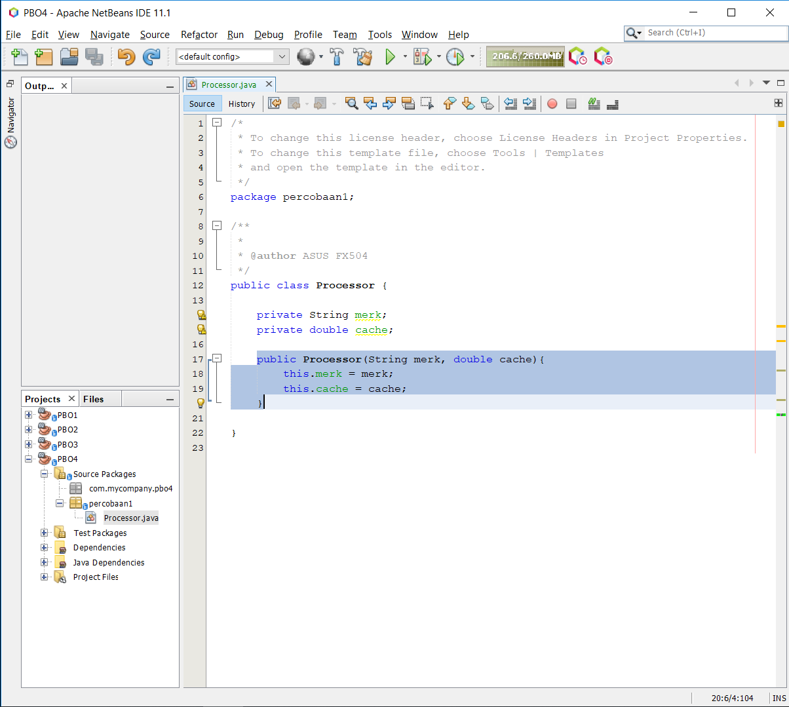
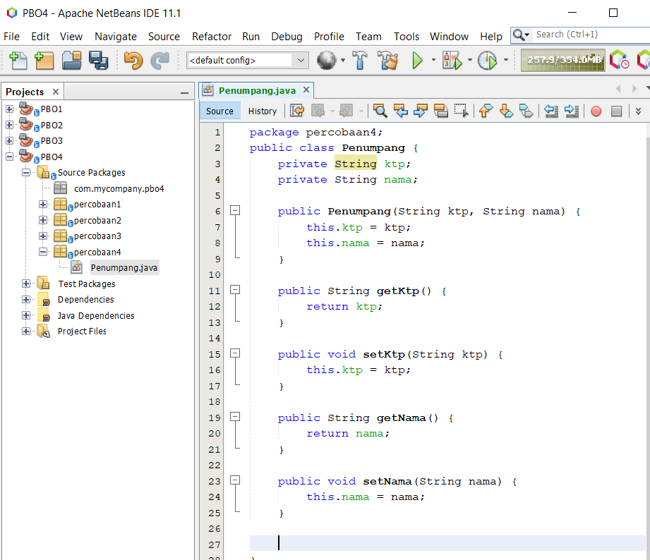
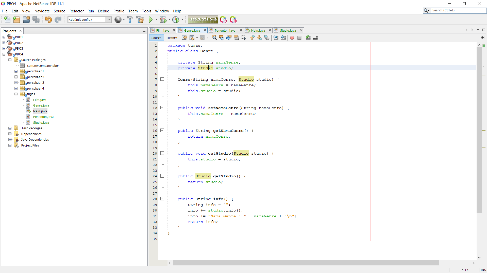

# Laporan Praktikum #4 - Relasi Kelas

## <h1>Kompetensi

Setelah menempuh pokok bahasan ini, mahasiswa mampu:
1. Memahami konsep relasi kelas;
2. Mengimplementasikan relasi has‑a dalam program.

## <h1>Ringkasan Materi
 
- Relasi
- Setter Getter
- Konstruktor
- Array 

### <h1>Percobaan 1

a. Perhatikan diagram class berikut:
 

b. Buka project baru di Netbeans dan buat package dengan format berikut:
<identifier>.relasiclass.percobaan1 (ganti dengan identitas anda atau nama
domain), Contoh: ac.id.polinema, jti.polinema, dan sebagainya).
Catatan: Penamaan package dengan tambahan identifier untuk menghindari adanya
kemungkinan penamaan class yang bentrok.

c. Buatlah class Processor dalam package tersebut.
 

d. Tambahkan atribut merk dan cache pada class Processor dengan akses modifier
private .
 

e. Buatlah constructor default untuk class Processor.
 

f. Buatlah constructor untuk class Processor dengan parameter merk dan cache.
 

g. Implementasikan setter dan getter untuk class Processor.
 

h. Implementasikan method info() seperti berikut:
 

i. Kemudian buatlah class Laptop di dalam package yang telah anda buat.
 

j. Tambahkan atribut merk dengan tipe String dan proc dengan tipe Object Processor
private String merk; private Processor proc;
 

k. Buatlah constructor default untuk class Laptop .
 

l. Buatlah constructor untuk class Laptop dengan parameter merk dan proc .
 

m. Selanjutnya implementasikan method info() pada class Laptop sebagai berikut
 

n. Pada package yang sama, buatlah class MainPercobaan1 yang berisi method
main().
 

o. Deklarasikan Object Processor dengan nama p kemudian instansiasi dengan informasi
atribut Intel i5 untuk nilai merk serta 3 untuk nilai cache .
 

p. Kemudian deklarasikan serta instansiasi Objek Laptop dengan nama L dengan informasi
atribut Thinkpad dan Objek Processor yang telah dibuat.
 

q. Panggil method info() dari Objek L.
 

r. Tambahkan baris kode berikut
 

s. Compile kemudian run class MainPercobaan1, akan didapatkan hasil seperti berikut:
 

Pertanyaan
Berdasarkan percobaan 1, jawablah pertanyaan‑pertanyaan yang terkait:

1. Di dalam class Processor dan class Laptop , terdapat method setter dan getter untuk masing‑masing atributnya. Apakah gunanya method setter dan getter tersebut ?
 -Fungsinya ialah mengeset dan mengambil suatu nilai dari sebuah class dengan method default.

2. Di dalam class Processor dan class Laptop, masing‑masing terdapat konstruktor default dan konstruktor berparameter. Bagaimanakah beda penggunaan dari kedua jenis konstruktor tersebut ? 
 -Jika konstruktor default maka akan memberi setter sebuah nilai dan jika konstruktor berparameter maka hanya memberi nilai di class main. 

3. Perhatikan class Laptop, di antara 2 atribut yang dimiliki (merk dan proc), atribut manakah yang bertipe object ?
 -Private Processor proc; 

4. Perhatikan class Laptop, pada baris manakah yang menunjukan bahwa class Laptop memiliki relasi dengan class Processor ?
 -Pada konstruktor berparameter. 
 

5. Perhatikan pada class Laptop , Apakah guna dari sintaks proc.info() ?
 -Untuk menjalankan method dari class Processor.

6. Pada class MainPercobaan1, terdapat baris kode:
Laptop l = new Laptop("Thinkpad", p);.
Apakah p tersebut ? Dan apakah yang terjadi jika baris kode tersebut diubah menjadi:
Laptop l = new Laptop("Thinkpad", new Processor("Intel i5",
3)); Bagaimanakah hasil program saat dijalankan, apakah ada perubahan ?
 -p adalah class Processor yang sudah di instansiasi. Code tersebut sama saja, hasilnya sama. Perbedaannya ialah pada instansiasi, jika p langsung memanggil class Processor yang sudah di instansiasi. 

link kode program :[Laptop](../../src/4_Relasi_Class/Percobaan1/Laptop.java)
 link kode program :[Main1](../../src/4_Relasi_Class/Percobaan1/MainPercobaan1.java)
 link kode program :[Processor](../../src/4_Relasi_Class/Percobaan1/Processor.java)

### <h1>Percobaan 2

Perhatikan diagram class berikut yang menggambarkan sistem rental mobil. Pelanggan bisa menyewa mobil sekaligus sopir. Biaya sopir dan biaya sewa mobil dihitung per hari.
 

a. Tambahkan package <identifier>.relasiclass.percobaan2.

b. Buatlah class Mobil di dalam package tersebut.
 

c. Tambahkan atribut merk tipe String dan biaya tipe int dengan akses modifier private.
 

d. Tambahkan constructor default serta setter dan getter.
 

e. Implementasikan method hitungBiayaMobil
 

f. Tambahkan class Sopir dengan atribut nama tipe String dan biaya tipe int dengan akses modifier private berikut dengan constructor default.
 

g. Implementasikan method hitungBiayaSopir. (Tambahkan setter dan getter di jobsheet tidak di tampilkan)
 

h. Tambahkan class Pelanggan dengan constructor default.
 

i. Tambahkan atribut‑atribut dengan akses modifier private berikut:
 

j. Implementasikan setter dan getter.
 

k. Tambahkan method hitungBiayaTotal
 

l. Buatlah class MainPercobaan2 yang berisi method main(). Tambahkan baris kode
berikut:
 

m. Compile dan jalankan class MainPercobaan2, dan perhatikan hasilnya!
 

Pertanyaan
1. Perhatikan class Pelanggan. Pada baris program manakah yang menunjukan bahwa class
Pelanggan memiliki relasi dengan class Mobil dan class Sopir ?
 

2. Perhatikan method hitungBiayaSopir pada class Sopir, serta method
hitungBiayaMobil pada class Mobil. Mengapa menurut Anda method tersebut harus
memiliki argument hari ?
- Karena 

3. Perhatikan kode dari class Pelanggan. Untuk apakah perintah
mobil.hitungBiayaMobil(hari) dan sopir.hitungBiayaSopir(hari) ?
- Untuk menjumlahkan biaya mobil yang diambil dari harga sopir lalu dikalikan dengan hari sebelumnya lalu dijumlahkan dengan biaya sopir yang diambil dari harga sopir dikali hari.

4. Perhatikan class MainPercobaan2. Untuk apakah sintaks p.setMobil(m) dan
p.setSopir(s) ?
- Digunakan untuk mengisi value dari namaMobil dan namaSopir di pelanggan.

5. Perhatikan class MainPercobaan2. Untuk apakah proses p.hitungBiayaTotal()
tersebut ?
- Digunakan untuk menghitung biaya total sopir+mobil.

6. Perhatikan class MainPercobaan2, coba tambahkan pada baris terakhir dari method
main dan amati perubahan saat di‑run!
System.out.println(p.getMobil().getMerk());
- Digunakan untuk return nilai atribut dari method getMerk()

link kode program :[Mobil](../../src/4_Relasi_Class/Percobaan2/Mobil.java)
 link kode program :[Pelanggan](../../src/4_Relasi_Class/Percobaan2/Pelanggan.java)
 link kode program :[Sopir](../../src/4_Relasi_Class/Percobaan2/Sopir.java)
 link kode program :[Main2](../../src/4_Relasi_Class/Percobaan2/Main.java)

### <h1>Percobaan 3

a. Sebuah Kereta Api dioperasikan oleh Masinis serta seorang Asisten Masinis. Baik Masinis
maupun Asisten Masinis keduanya merupakan Pegawai PT. Kereta Api Indonesia. Dari
ilustrasi cerita tersebut, dapat digambarkan dalam diagram kelas sebagai berikut:

b. Perhatikan dan pahami diagram kelas tersebut, kemudian bukalah IDE anda!

c. Buatlah package <identifier>.relasiclass.percobaan3, kemudian tambahkan
class Pegawai.
 

d. Tambahkan atribut‑atribut ke dalam class Pegawai
 

e. Buatlah constructor untuk class Pegawai dengan parameter nip dan nama.
 

f. Tambahkan setter dan getter untuk masing‑masing atribut.
 

g. Implementasikan method info() dengan menuliskan baris kode berikut:
 

h. Buatlah class KeretaApi berdasarkan diagram class
 

i. Tambahkan atribut‑atribut pada class KeretaApi berupa nama, kelas, masinis, dan
asisten.
 

j. Tambahkan constructor 3 parameter (nama, kelas, masinis) serta 4 parameter (nama,
kelas, masinis, asisten).
 

 

k. Tambahkan setter dan getter untuk atribut‑atribut yang ada pada class KeretaApi .
 

l. Kemudian implementasikan method info()
 

m. Buatlah sebuah class MainPercobaan3 dalam package yang sama.

n. Tambahkan method main() kemudian tuliskan baris kode berikut
 

Pertanyaan 
1. Di dalam method info() pada class KeretaApi, baris this.masinis.info() dan
this.asisten.info() digunakan untuk apa ?
- untuk memanggil method info yang ada di class Pegawai

2. Buatlah main program baru dengan nama class MainPertanyaan pada package yang
sama. Tambahkan kode berikut pada method main() !
Pegawai masinis = new Pegawai("1234", "Spongebob
Squarepants");
KeretaApi keretaApi = new KeretaApi("Gaya Baru", "Bisnis",
masinis);
System.out.println(keretaApi.info());
 

3. Apa hasil output dari main program tersebut ? Mengapa hal tersebut dapat terjadi ?
  
- dikarenakan tidak adanya variabel, variabel tersebut adalah asisten di class KeretaApi.

4. Perbaiki class KeretaApi sehingga program dapat berjalan !
  

link kode program :[KeretaApi](../../src/4_Relasi_Class/Percobaan3/KeretaApi.java)
 link kode program :[Pegawai](../../src/4_Relasi_Class/Percobaan3/Pegawai.java)
 link kode program :[Main3](../../src/4_Relasi_Class/Percobaan3/MainPercobaan3.java)

### <h1>Percobaan 4 
a. Perhatikan dan pahami diagram class tersebut.

b. Buatlah masing‑masing class Penumpang, Kursi dan Gerbong sesuai rancangan
tersebut pada package <identifier>.relasiclass.percobaan4.
  

 

   

c. Tambahkan method info() pada class Penumpang
  

d. Tambahkan method info() pada class Kursi
  

e. Pada class Gerbong buatlah method initKursi() dengan akses private.
  

f. Panggil method initKursi() dalam constructor Gerbong sehingga baris kode menjadi
berikut:
  

g. Tambahkan method info() pada class Gerbong
  

h. Implementasikan method untuk memasukkan penumpang sesuai dengan nomor kursi.
  

i. Buatlah class MainPercobaan4 yang berisi method main(). Kemudian tambahkan
baris berikut!
  

1. Pada main program dalam class MainPercobaan4, berapakah jumlah kursi dalam
Gerbong A ?
- 10 kursi

2. Perhatikan potongan kode pada method info() dalam class Kursi. Apa maksud kode
tersebut ?
- Digunakan untuk menampilkan kursi yang terisi oleh penumpang.

3. Mengapa pada method setPenumpang() dalam class Gerbong, nilai nomor dikurangi
dengan angka 1 ?
- Karena index array dimulai dari 0 maka index harus dikurangi 1 sehingga index pertama terisi.

4. Instansiasi objek baru budi dengan tipe Penumpang, kemudian masukkan objek baru
tersebut pada gerbong dengan gerbong.setPenumpang(budi, 1). Apakah yang
terjadi ?
 

5. Modifikasi program sehingga tidak diperkenankan untuk menduduki kursi yang sudah ada
penumpang lain !
 

link kode program :[Gerbong](../../src/4_Relasi_Class/Percobaan4/Gerbong.java)
 link kode program :[Kursi](../../src/4_Relasi_Class/Percobaan4/Kursi.java)
 link kode program :[Penumpang](../../src/4_Relasi_Class/Percobaan4/Penumpang.java)
 link kode program :[Main4](../../src/4_Relasi_Class/Percobaan4/MainPercobaan4.java)

### <h1> TUGAS
Buatlah sebuah studi kasus, rancang dengan class diagram, kemudian implementasikan ke dalam
program! Studi kasus harus mewakili relasi class dari percobaan‑percobaan yang telah dilakukan
pada materi ini, setidaknya melibatkan minimal 4 class (class yang berisi main tidak dihitung).

 
 
 
 
 

link kode program :[Film](../../src/4_Relasi_Class/tugas/Film.java)
 link kode program :[Genre](../../src/4_Relasi_Class/tugas/Genre.java)
 link kode program :[Penonton](../../src/4_Relasi_Class/tugas/Penonton.java)
 link kode program :[Studio](../../src/4_Relasi_Class/tugas/Studio.java)
 link kode program :[Main](../../src/4_Relasi_Class/tugas/Main.java)

## <h1>Kesimpulan

- Dari jobsheet ini kita masih mempelajari setter dan getter. Selain itu kita juga akan belajar dan mamahami relasi antar class ke class

## <h1>Pernyataan Diri

Saya menyatakan isi tugas, kode program, dan laporan praktikum ini dibuat oleh saya sendiri. Saya tidak melakukan plagiasi, kecurangan, menyalin/menggandakan milik orang lain.

Jika saya melakukan plagiasi, kecurangan, atau melanggar hak kekayaan intelektual, saya siap untuk mendapat sanksi atau hukuman sesuai peraturan perundang-undangan yang berlaku.

Ttd,

Aryo Satyo Wandowo Adi - 05

