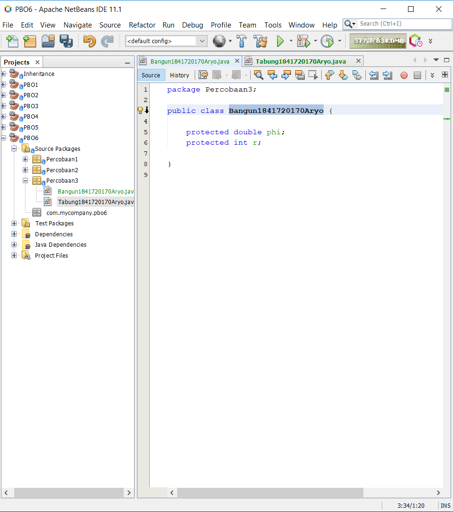
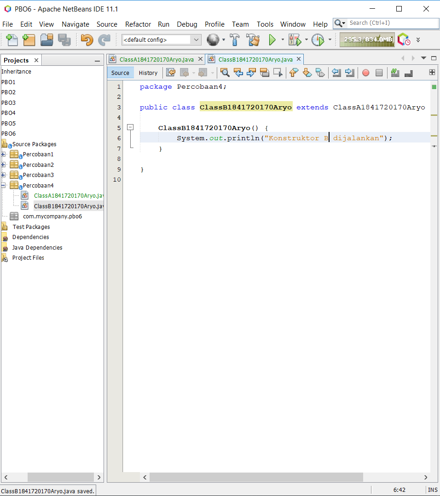

# Laporan Praktikum #6 - Inheritance

## <h1>Kompetensi

## <h1>Ringkasan Materi
 

### <h1>Percobaan 1

A. Tahapan Percobaan
1. Buatlah	sebuah	class	parent/superclass	dengan nama ClassA.java
 

2. Buatlah	sebuah	class	anak/subclass	dengan	nama ClassB.java
 

3. Buatlah	class	Percobaan1.java	untuk	menjalankan	program	diatas!
 

4. Jalankan	program	diatas,	kemudian	amati	apa	yang terjadi!
 

link kode program :[ClassA](../../src/6_Inheritance/Percobaan1/classA1841720170Aryo.java)
 link kode program :[ClassB](../../src/6_Inheritance/Percobaan1/classB1841720170Aryo.java)
 link kode program :[newMain](../../src/6_Inheritance/Percobaan1/NewMain.java)

B. PERTANYAAN

1. Pada	percobaan 1 diatas program yang	dijalankan	terjadi	error,	kemudian perbaiki sehingga program tersebut bisa dijalankan dan tidak error!
-
2. Jelaskan	apa	penyebab program pada percobaan	1	ketika dijalankan terdapat error!
-

### <h1>Percobaan 2

A. TAHAPAN	PERCOBAAN

1. Buatlah sebuah class	parent/superclass dengan	nama ClassA.java
 

2. Buatlah	sebuah	class	anak/subclass	dengan	nama	ClassB.java
 

3. Buatlah	class	Percobaan2.java	untuk	menjalankan	program	diatas!
 

link kode program :[ClassA](../../src/6_Inheritance/Percobaan2/ClassA1841720170Aryo.java)
 link kode program :[ClassB](../../src/6_Inheritance/Percobaan2/ClassB1841720170Aryo.java)
 link kode program :[newMain](../../src/6_Inheritance/Percobaan2/NewMain.java)

B. PERTANYAAN

1. Pada	percobaan	2 diatas	program	yang	dijalankan terjadi error, kemudian perbaiki	sehingga program	tersebut bisa dijalankan dan tidak error!
-

2. Jelaskan	apa	penyebab program pada percobaan	1	ketika dijalankan terdapat error!
-

### <h1>Percobaan 3

A. TAHAPAN	PERCOBAAN

1. Buatlah sebuah class parent/superclass	dengan nama Bangun.java
 

2. Buatlah	sebuah	class	anak/subclass	dengan	nama Tabung.java
 

3. Buatlah	class	Percobaan3.java	untuk	menjalankan	program	diatas!
 

4. Jalankan	program	diatas!
 

link kode program :[Bangun](../../src/6_Inheritance/Percobaan3/Bangun1841720170Aryo.java)
 link kode program :[Tabung](../../src/6_Inheritance/Percobaan3/Tabung1841720170Aryo.java)
 link kode program :[newMain](../../src/6_Inheritance/Percobaan3/NewMain.java)

B. PERTANYAAN

1. Jelaskan	fungsi	 “super”	pada	potongan	program	berikut	di	class	Tabung!
- 

2. Jelaskan	fungsi	“super”	dan	“this”	pada	potongan	program	berikut	di	class	Tabung!
- 

3. Jelaskan	mengapa	pada class Tabung tidak	dideklarasikan	atribut	“phi” dan “r” tetapi class tersebut dapat mengakses atribut tersebut!
- 

### <h1>Percobaan 4 

A. TAHAPAN	PERCOBAAN

1. Buatlah	tiga	file	dengan	nama	ClassA.java	,	ClassB.java	,	dan	ClassC.java,	seperti	pada kode program dibawah ini!

ClassA1841720170Aryo
 

ClassB1841720170Aryo
 

ClassC1841720170Aryo
 

2. Buatlah	class	Percobaan4.java	untuk	menjalankan	program	diatas!
3. Jalankan	program	kemudian	amati	apa	yang	terjadi!
 

link kode program :[Class A](../../src/6_Inheritance/Percobaan4/ClassA1841720170Aryo.java)
 link kode program :[Class B](../../src/6_Inheritance/Percobaan4/ClassB1841720170Aryo.java)
 link kode program :[Class C](../../src/6_Inheritance/Percobaan4/ClassC1841720170Aryo.java)
 link kode program :[NewMain](../../src/6_Inheritance/Percobaan4/NewMain.java)

B. PERTANYAAN

1. Pada	percobaan	4	sebutkan	mana	class	yang	termasuk	superclass	dan	subclass,	kemudian	
jelaskan	alasannya!
-

2. Ubahlah	isi	konstruktor	default	ClassC	seperti	berikut:
-
Tambahkan	kata	super()	di	baris	Pertaman	dalam	konstruktor	defaultnya.	Coba	jalankan	
kembali	class	Percobaan4	dan	terlihat	tidak	ada	perbedaan	dari	hasil	outputnya!

3. Ublah	isi	konstruktor	default	ClassC	seperti	berikut:
-
Ketika	mengubah	posisi	super()	dibaris	kedua	dalam	kontruktor	defaultnya	dan	terlihat	ada	
error.	Kemudian	kembalikan	super()	kebaris	pertama	seperti	sebelumnya,	maka	errornya	
akan	hilang.
Perhatikan	hasil	keluaran	ketika	class	Percobaan4	dijalankan.	Kenapa	bisa	tampil	output	
seperti	berikut	pada	saat	instansiasi	objek	test	dari	class	ClassC

4. Apakah	fungsi	super()	pada	potongan	program	dibawah	ini	di	ClassC!
-

### <h1>Percobaan 5 

1. Buatlah	class	Karyawan	
 

2. Buatlah	class	Manager	
 

3. Buatlah	class	Staff	
 

4. Buatlah	class	inheritance1	
 

5. Jalankan	program,	maka	tampilanya	adalah	sebagai	berikut:
 

link kode program :[Karyawan](../../src/6_Inheritance/Percobaan5/Karyawan1841720170Aryo.java)
 link kode program :[Manager](../../src/6_Inheritance/Percobaan5/Manager1841720170Aryo.java)
 link kode program :[Staff](../../src/6_Inheritance/Percobaan5/Staff1841720170Aryo.java)
 link kode program :[NewMain](../../src/6_Inheritance/Percobaan5/NewMain.java)

B. PERTANYAAN
1. Sebutkan	class	mana	yang	termasuk	super	class	dan	sub	class	dari	percobaan	1	diatas!
- 
2. Kata	kunci	apakah	yang	digunakan	untuk	menurunkan	suatu	class	ke	class	yang	lain?
- 
3. Perhatikan	kode	program	pada	class	Manager,	atribut	apa	saja	yang	dimiliki	oleh	class	
tersebut?	Sebutkan	atribut	mana	saja	yang	diwarisi	dari	class	Karyawan!
-
4. Jelaskan	kata	kunci	super	pada	potongan	program	dibawah	ini	yang	terdapat	pada	class	
Manager!
-
5. Program	pada	percobaan	1	diatas	termasuk	dalam	jenis	inheritance	apa?	Jelaskan	
alasannya!
-

### <h1>Percobaan 6 

2. Berdasarkan	program	yang	sudah	anda	buat	pada	percobaan	1	sebelumnya	tambahkan	dua	
class	yaitu	class	StaffTetap	dan	class	StaffHarian.	Kode	Programnya	adalah	sebagai	berikut

staffTetap1841720170Aryo
 

staffHarian1841720170Aryo
 

3. Setelah	membuat	dua	class	diatas	kemudian	edit	class	inheritance1.java	menjadi	sebagai	
berikut:
4. Jalankan	program	maka	tampilanny	adalah	sebagai	berikut:
 

link kode program :[Staff Harian](../../src/6_Inheritance/Percobaan6/staffHarian1841720170Aryo.java)
 link kode program :[Staff Tetap](../../src/6_Inheritance/Percobaan6/staffTetap1841720170Aryo.java)
 link kode program :[Staff](../../src/6_Inheritance/Percobaan6/Staff1841720170Aryo.java)
 link kode program :[New Main](../../src/6_Inheritance/Percobaan6/NewMain.java)

B. PERTANYAAN
1. Berdasarkan	class	diatas	manakah	yang	termasuk	single	inheritance	dan	mana	yang	
termasuk	multilevel	inheritance?
-
2. Perhatikan	kode	program	class	StaffTetap	dan	StaffHarian,	atribut	apa	saja	yang	dimiliki	oleh	
class	tersebut?	Sebutkan	atribut	mana	saja	yang	diwarisi	dari	class	Staff!
-
3. Apakah	fungsi	potongan	program	berikut	pada	class	StaffHarian
-
4. Apakah	fungsi	potongan	program	berikut	pada	class	StaffHarian
-
9. Perhatikan	kode	program	dibawah	ini	yang	terdapat	pada	class	StaffTetap
-
Terlihat	dipotongan	program	diatas	atribut	gaji,	lembur	dan	potongan	dapat	diakses	
langsung.	Kenapa	hal	ini	bisa	terjadi	dan	bagaimana	class	StaffTetap	memiliki	atribut	gaji,	
lembur,	dan	potongan	padahal	dalam	class	tersebut	tidak	dideklarasikan	atribut	gaji,	lembur,	
dan	potongan?

### <h1> TUGAS

## <h1>Kesimpulan

## <h1>Pernyataan Diri

Saya menyatakan isi tugas, kode program, dan laporan praktikum ini dibuat oleh saya sendiri. Saya tidak melakukan plagiasi, kecurangan, menyalin/menggandakan milik orang lain.

Jika saya melakukan plagiasi, kecurangan, atau melanggar hak kekayaan intelektual, saya siap untuk mendapat sanksi atau hukuman sesuai peraturan perundang-undangan yang berlaku.

Ttd,

Aryo Satyo Wandowo Adi - 05

