# Laporan Praktikum #7 - Overriding And Overloading

## <h1>Kompetensi

Setelah menempuh pokok bahasan ini, mahasiswa mampu :
a. Memahami konsep overloading dan overriding,
b. Memahami perbedaan overloading dan overriding,
c. Ketepatan dalam mengidentifikasi method overriding dan overloading
d. Ketepatan dalam mempraktekkan instruksi pada jobsheet
e. Mengimplementasikan method overloading dan overriding 

## <h1>Ringkasan Materi
 
- Method overloading artinya method dengan nama yang sama, namun memiliki parameter yang berbeda, dan method ini berada dalam sebuah class yang sama atau bisa juga berada dalam class yang lain yang terkait dalam hirarki inheritance.

- Method overriding merupakan method yang parrent class yang ditulis kembali oleh subclass. Aturan dari method overriding pada Java :

 1. Parameter yang terdapat pada method overriding di subclass harus sama dengan parameter yang terdapat pada parent class.
 2. Aturan hak akses, hak akses method overriding di subclass tidak boleh lebih ketat di bandingkan dengan hak akses method pada parent class.

### <h1>3.Praktikum

3.1 Percobaan 1

Untuk kasus contoh berikut ini, terdapat tiga kelas, yaitu Karyawan, Manager, dan Staff.
Class Karyawan merupakan superclass dari Manager dan Staff dimana subclass Manager dan
Staff memiliki method untuk menghitung gaji yang berbeda.

 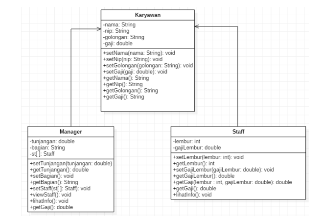

3.2 Karyawan

 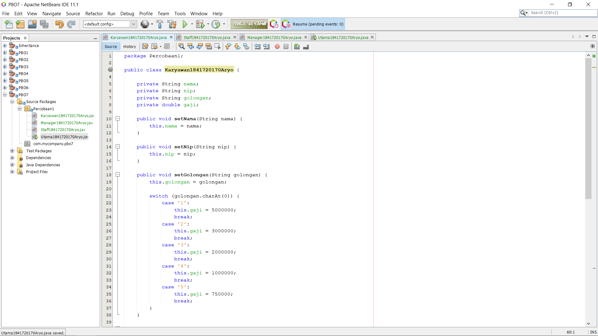
 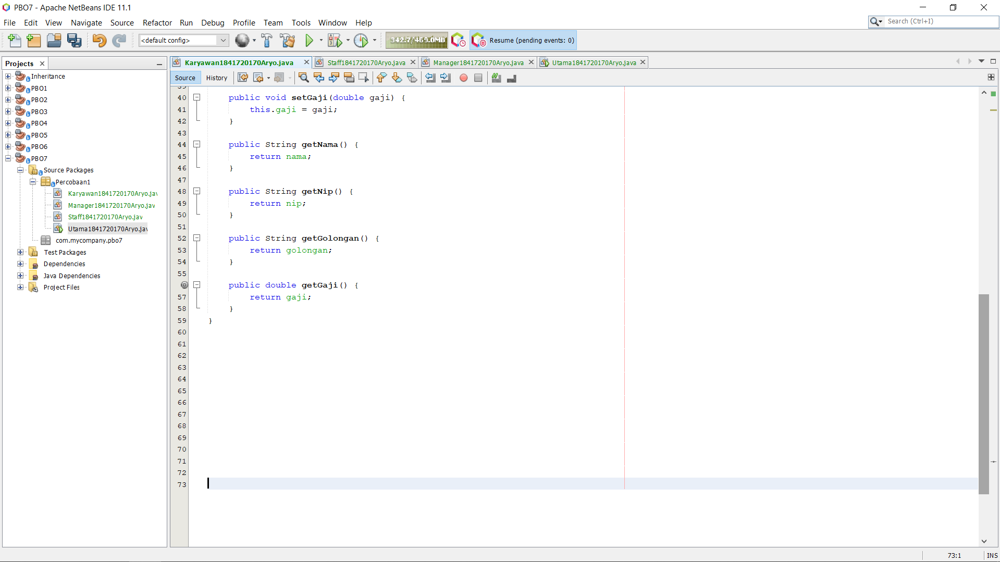
 link kode program :[Karyawan](../../src/7_Overriding_dan_Overloading/Percobaan1/Karyawan1841720170Aryo.java)

3.3 Staff

 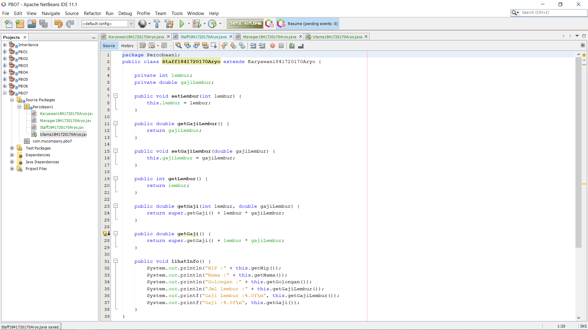
 link kode program :[Staff](../../src/7_Overriding_dan_Overloading/Percobaan1/Staff1841720170Aryo.java)

3.4 Manager

 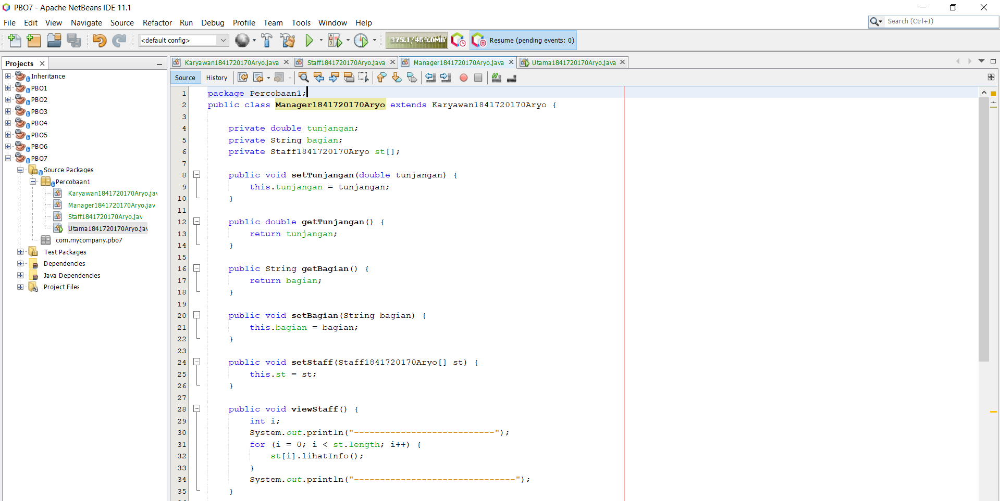
 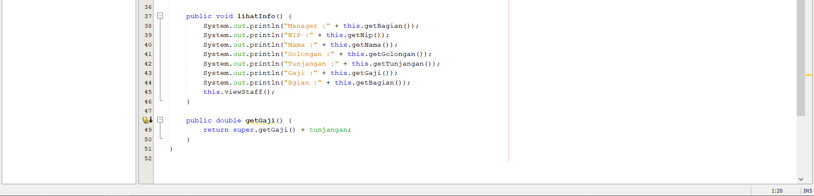
 link kode program :[Manager](../../src/7_Overriding_dan_Overloading/Percobaan1/Manager1841720170Aryo.java)

3.5 Utama

 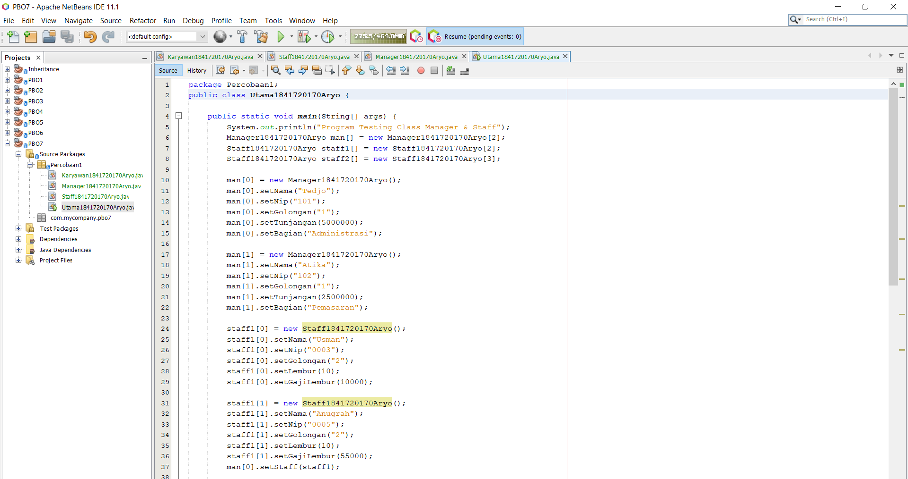
 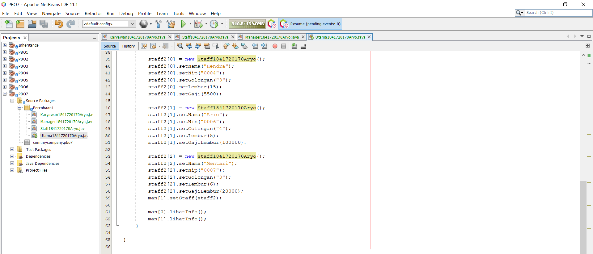
 link kode program :[Utama](../../src/7_Overriding_dan_Overloading/Percobaan1/Utama1841720170Aryo.java)

### <h1>4. Latihan

 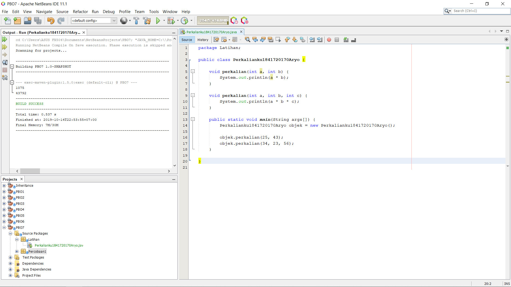

 4.1 Dari source coding diatas terletak dimanakah overloading?
-  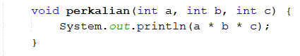

 4.1 Dari source coding diatas terletak dimanakah overloading?
- 1 Parameter.

 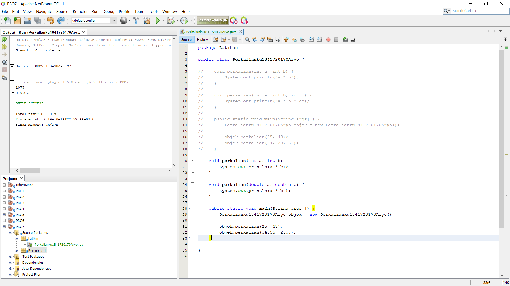
 link kode program :[ 1.Perkalianku](../../src/7_Overriding_dan_Overloading/Latihan/Perkalianku1841720170Aryo.java)

 4.3 Dari source coding diatas terletak dimanakah overloading?
-  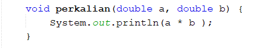

 4.4 Jika terdapat overloading ada berapa tipe parameter yang berbeda?
- 2 Parameter.

 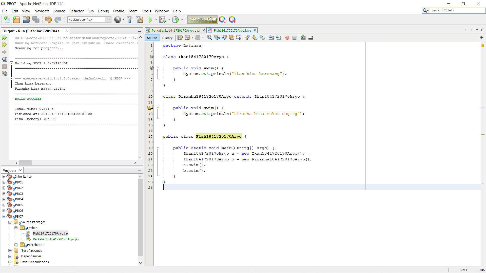
 link kode program :[ 2. Perkalianku ](../../src/7_Overriding_dan_Overloading/Latihan/Fish1841720170Aryo.java)

 4.5 Dari source coding diatas terletak dimanakah overriding?
-  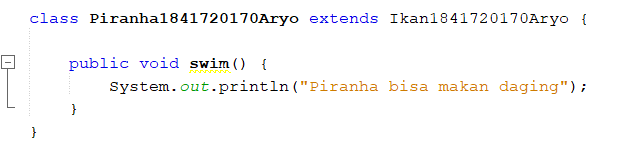

 4.6 Jabarkanlah apabila sourcoding diatas jika terdapat overriding?
- Isi method swim pada class Piranha akan dirubah menjadi ( println("Piranha bisa makan daging"); ) itu yang disebut overriding.

### <h1> 5. Tugas

5.1 Overloading

 Implementasikan konsep overloading pada class diagram dibawah ini :
 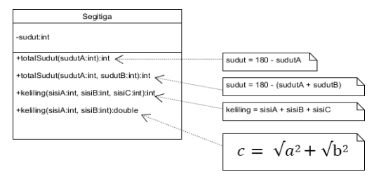
  
 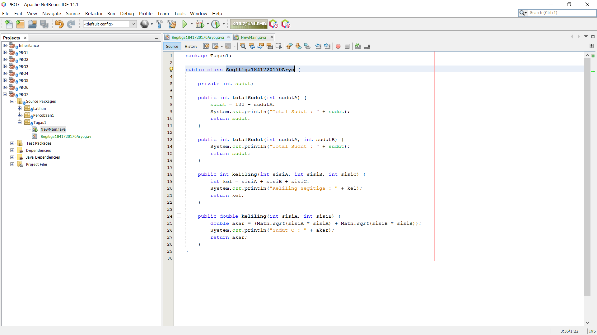
 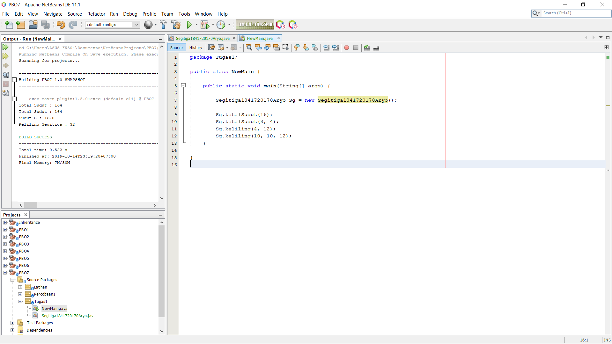
 link kode program :[ Segitiga](../../src/7_Overriding_dan_Overloading/Tugas1/Segitiga1841720170Aryo.java)
 link kode program :[ Main](../../src/7_Overriding_dan_Overloading/Tugas1/NewMain.java)

5.2 Overriding

 Implementasikan class diagram dibawah ini dengan menggunakan teknik dynamic
method dispatch :
 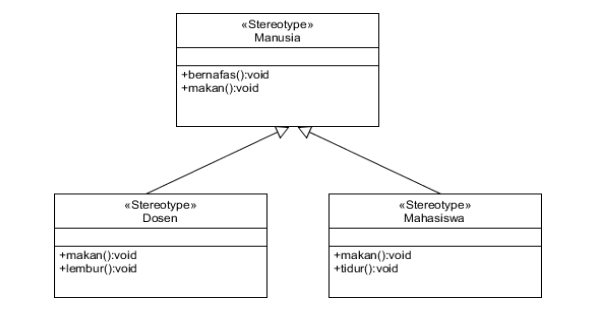
  
 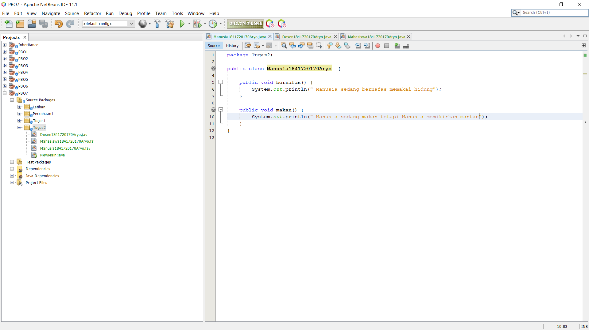
 link kode program :[ Manusia](../../src/7_Overriding_dan_Overloading/Tugas2/Manusia1841720170Aryo.java)

 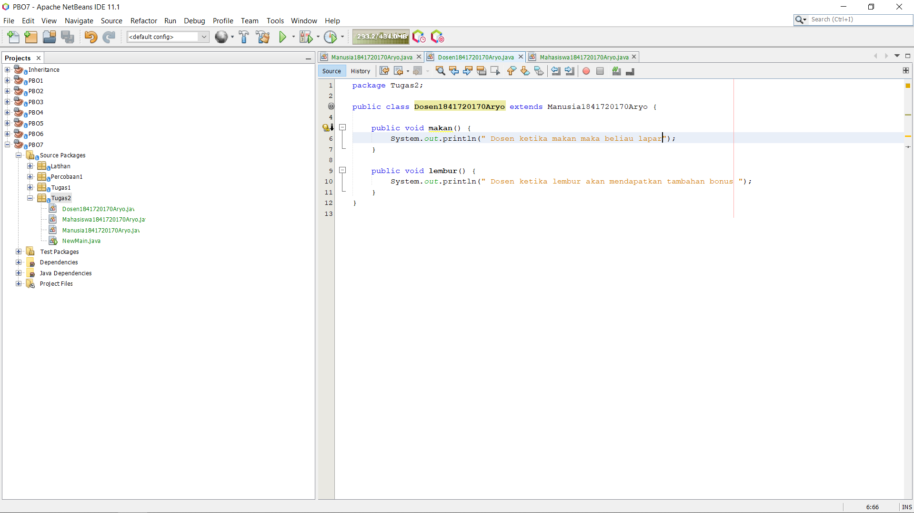
 link kode program :[ Dosen](../../src/7_Overriding_dan_Overloading/Tugas2/Dosen1841720170Aryo.java)

 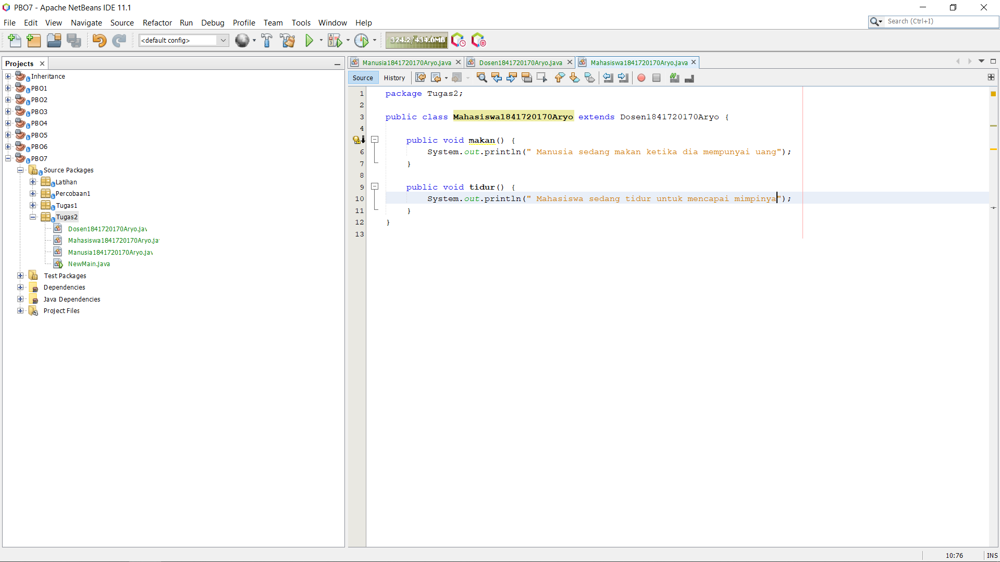
 link kode program :[ Mahasiswa](../../src/7_Overriding_dan_Overloading/Tugas2/Mahasiswa1841720170Aryo.java)

 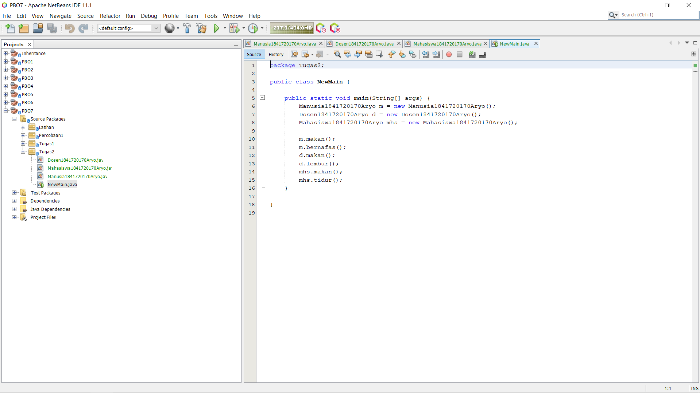
 link kode program :[ Main](../../src/7_Overriding_dan_Overloading/Tugas2/NewMain.java)

## <h1>Kesimpulan

- Method Overloading adalah sebuah kemampuan yang membolehkan sebuah class mempunyai 2 atau lebih method dengan nama yang sama, yang membedakan adalah parameternya.

- Method overriding merupakan method yang parrent class yang ditulis kembali oleh subclass.

## <h1>Pernyataan Diri

Saya menyatakan isi tugas, kode program, dan laporan praktikum ini dibuat oleh saya sendiri. Saya tidak melakukan plagiasi, kecurangan, menyalin/menggandakan milik orang lain.

Jika saya melakukan plagiasi, kecurangan, atau melanggar hak kekayaan intelektual, saya siap untuk mendapat sanksi atau hukuman sesuai peraturan perundang-undangan yang berlaku.

Ttd,

Aryo Satyo Wandowo Adi - 05

