# Laporan Praktikum #9 - Abstract Class dan Interface

## <h1>Kompetensi

Setelah menyelesaikan lembar kerja ini mahasiswa diharapkan mampu:
1. Menjelaskan maksud dan tujuan penggunaan Abstract Class;
2. Menjelaskan maksud dan tujuan penggunaan Interface;
3. Menerapkan Abstract Class dan Interface di dalam pembuatan program.

## <h1>Ringkasan Materi
 
 Interface adalah struktur data yang hanya berisi abstract methods. Tidak ada apa-apa selain method
abstract pada interface, termasuk atribut getter dan setter.
 Abstract Class adalah sebuah class yang tidak bisa di-instansiasi (tidak bisa dibuat menjadi objek) dan berperan sebagai 'kerangka dasar' bagi class turunannya. Di dalam abstract class umumnya akan memiliki abstract method.

### <h1>Praktikum

<h2>Percobaan 1: Abstract Class</h2>

Class Hewan : 
 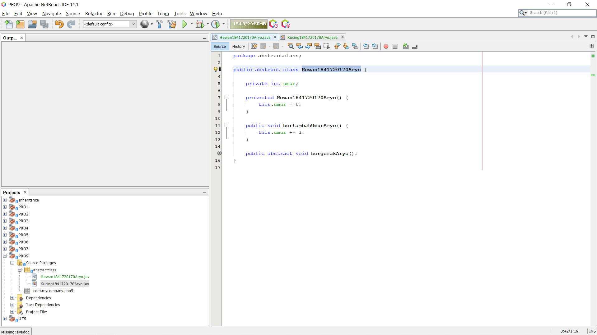
 Class Hewan tersebut adalah class abstract berisi property dan method biasa, ditambah sebuah
method abstract bernama bergerak(). Method tersebut didepannya terdapat kata kunci abstract
dan tidak memiliki badan fungsi. Method ini nantinya akan di-override oleh class mana saja yang
menjadi class turunan dari class Hewan tersebut.
  link kode program :[Hewan](../../src/9_Abstract_Class_dan_Interface/abstractclass/Hewan1841720170Aryo.java)

  
Class Kucing : 
 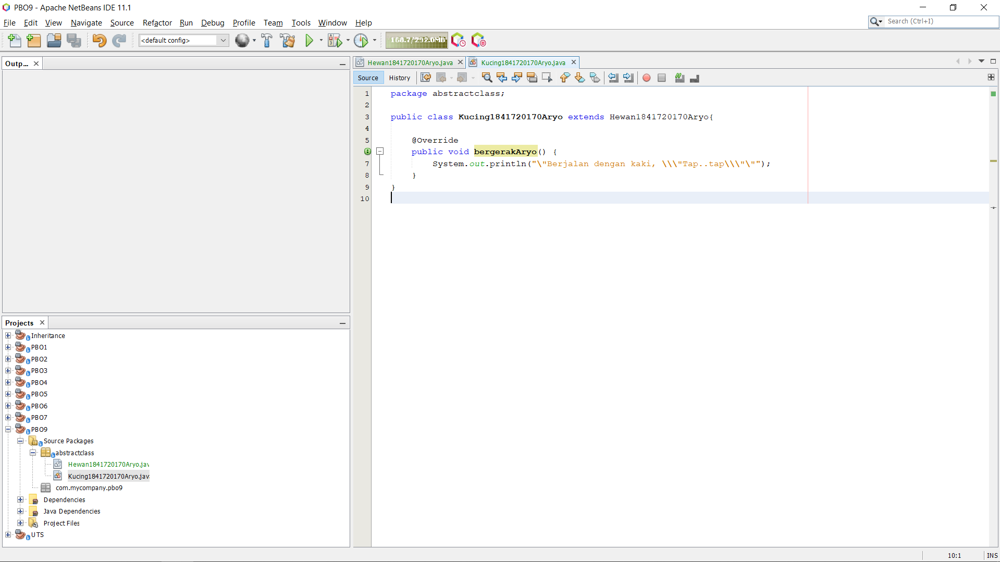
link kode program :[Kucing](../../src/9_Abstract_Class_dan_Interface/abstractclass/Kucing1841720170Aryo.java)

Class Ikan : 
 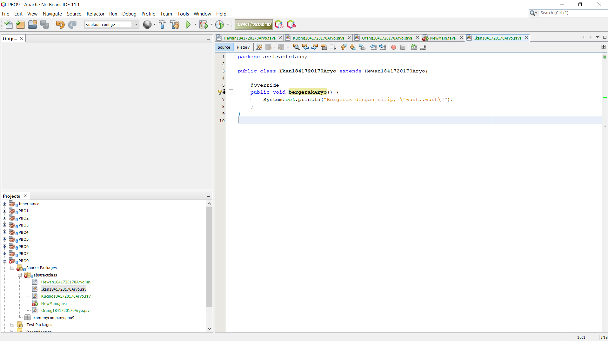
link kode program :[Ikan](../../src/9_Abstract_Class_dan_Interface/abstractclass/Ikan1841720170Aryo.java)
 

Class Orang : 
 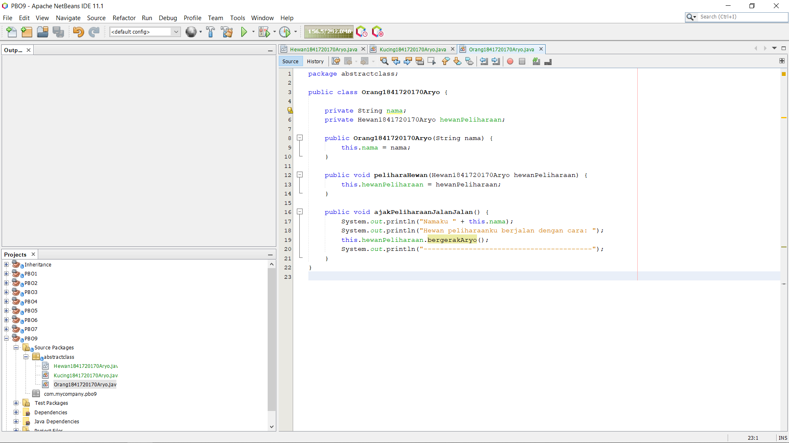
 Class ini adalah class yang
menjadi pengguna dari class abstract Hewan yang sudah dibuat sebelumnya. Ketikkan pada class
Orang tersebut, baris-baris kode seperti di bawah.
  link kode program :[Orang](../../src/9_Abstract_Class_dan_Interface/abstractclass/Orang1841720170Aryo.java)

  
Class Main : 
 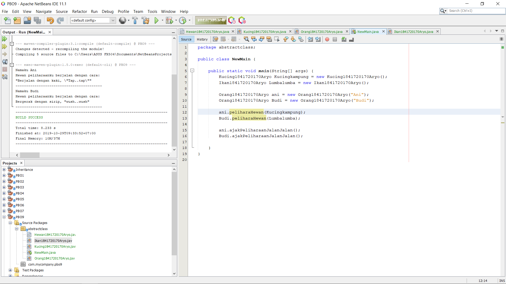
link kode program :[NewMain](../../src/9_Abstract_Class_dan_Interface/abstractclass/NewMain.java)

 Pertanyaan diskusi:
 Bolehkah apabila sebuah class yang meng-extend suatu abstract class tidak
mengimplementasikan method abstract yang ada di class induknya? Buktikan!
- Tidak bisa, dikarenakan ketika kita sedang extends maka method akan mewarisi sifat yang ada pada class yang kita extends.

<h2>Percobaan 2: Interface</h2>

Class iCumlaude : 
 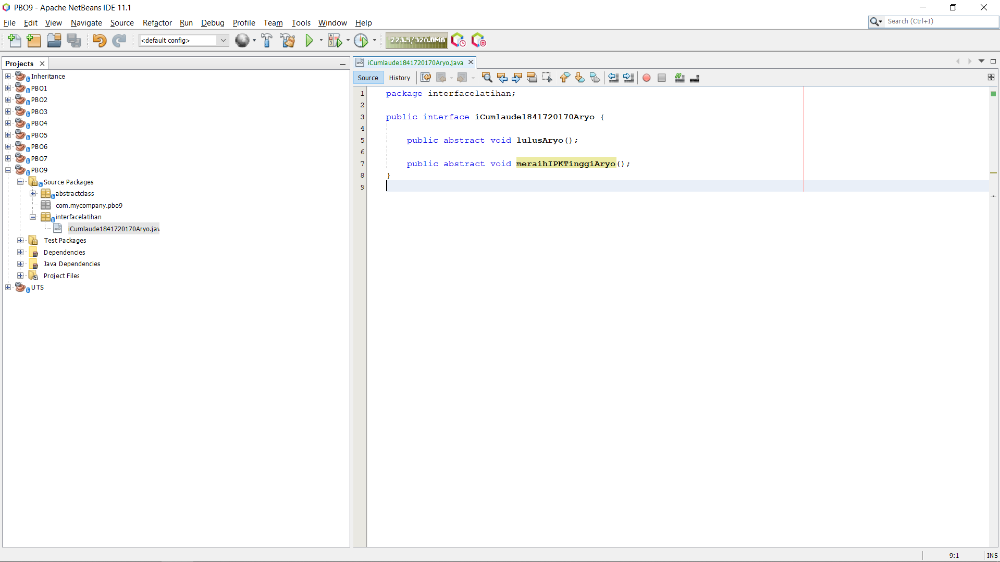
link kode program :[iCumlaude](../../src/9_Abstract_Class_dan_Interface/interfacelatihan/iCumlaude1841720170Aryo.java)

Class Mahasiswa : 
 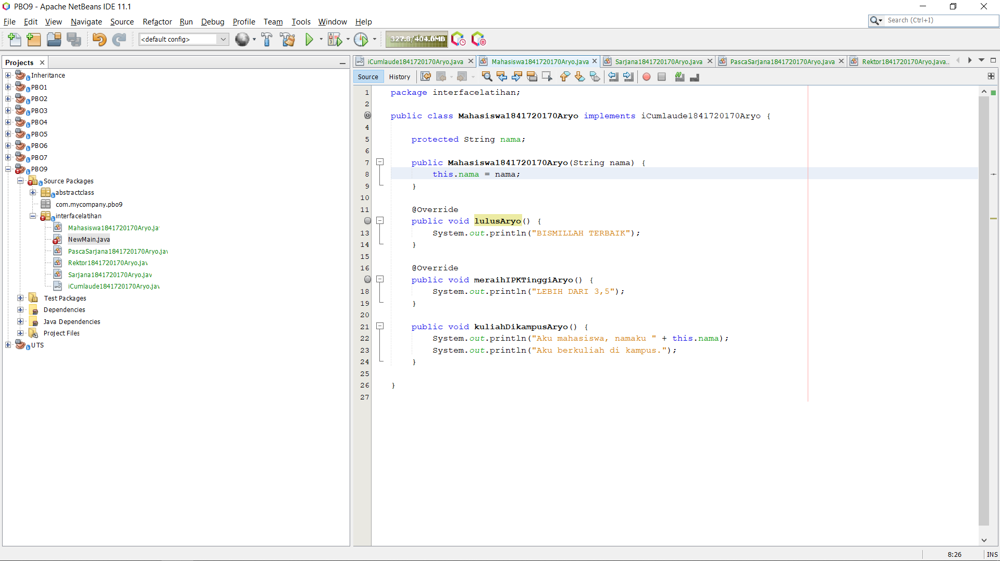
link kode program :[Mahasiswa](../../src/9_Abstract_Class_dan_Interface/interfacelatihan/Mahasiswa1841720170Aryo.java)

Class Sarjana : 
 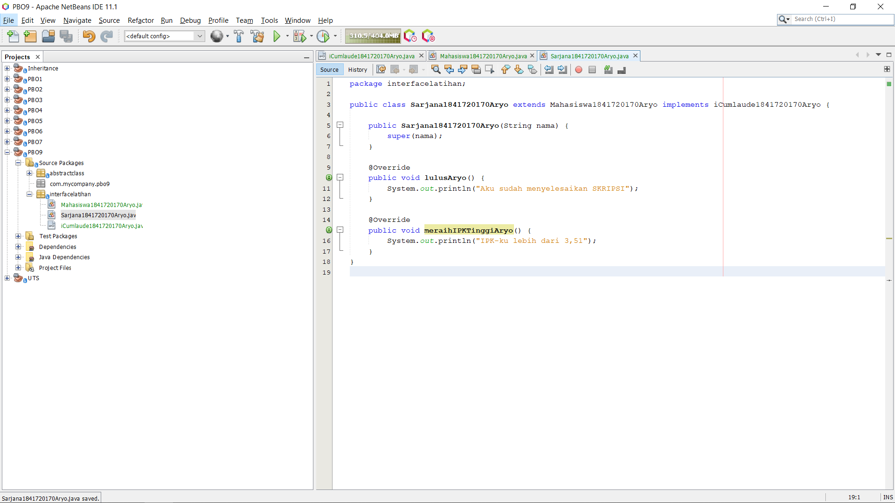
link kode program :[Sarjana](../../src/9_Abstract_Class_dan_Interface/interfacelatihan/Sarjana1841720170Aryo.java)
 Sarjana yang merupakan turunan dari class
Mahasiswa. Class Sarjana tersebut dibuat meng-implements interface ICumlaude yang sudah dibuat sebelumnya tadi.

 Perhatikan pada baris kode di atas, class Sarjana meng-extend class Mahasiswa, ini berarti,
Sarjana adalah Mahasiswa sementara itu agar semua objek dari class Sarjana ini nantinya dapat
disebut sebagai Cumlaude maka ia harus meng-implements interface ICumlaude
  

Class PascaSarjana : 
 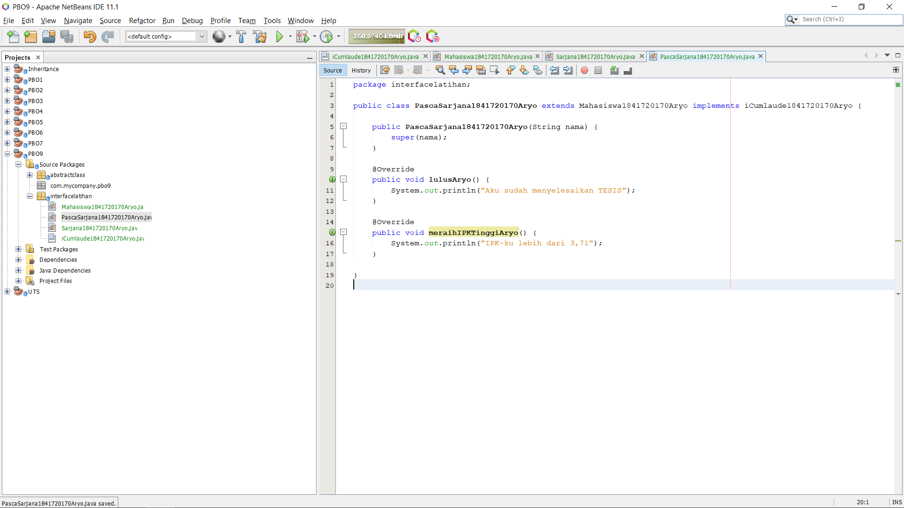
link kode program :[PascaSarjana](../../src/9_Abstract_Class_dan_Interface/interfacelatihan/PascaSarjana1841720170Aryo.java)

Class Rektor : 
 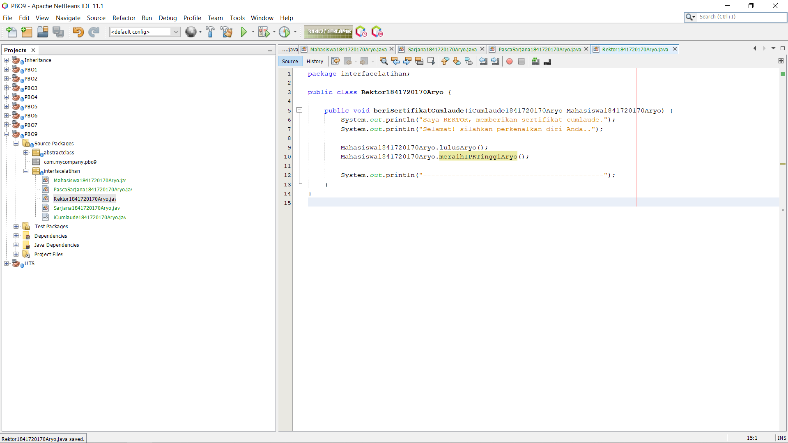
link kode program :[Rektor](../../src/9_Abstract_Class_dan_Interface/interfacelatihan/Rektor1841720170Aryo.java)
 Class ini adalah class yang memanfaatkan classclass Mahasiswa yang telah dibuat sebelumnya.
  

Class Main : 
 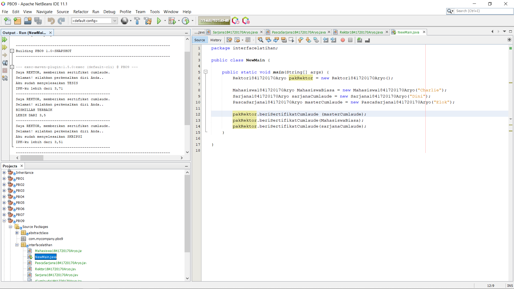
link kode program :[NewMain](../../src/9_Abstract_Class_dan_Interface/interfacelatihan/NewMain.java)

<h2>Pertanyaan diskusi:</h2>
 a. Mengapa pada langkah nomor 9 terjadi error? Jelaskan!
  - Dikarenakan 'mahasiswaBiasa' tidak dideklarasikan.

 b. Dapatkah method kuliahDiKampus() dipanggil dari objek sarjanaCumlaude di class Program? Mengapa demikian?
  - Bisa, dikarenakan pada class sarjana sudah di instansiasi object sarjanaCumlaude di class Main dan Class Sarjana sudah extends dengan class mahasiswa.

 c. Dapatkah method kuliahDiKampus() dipanggil dari parameter mahasiswa di method beriSertifikatCumlaude() pada class Rektor? Mengapa demikian?
  - Bisa ketika object memanggil method tsb dan terdapat parameter.

 d. Modifikasilah method beriSertifikatCumlaude() pada class Rektor agar hasil eksekusi class Program menjadi seperti berikut ini:
 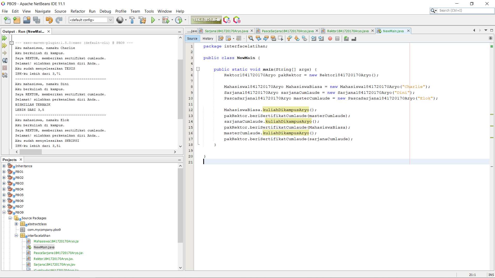

<h2>Percobaan 3 : Multiple Interfaces Implementation</h2>

Class iBerprestasi : 
 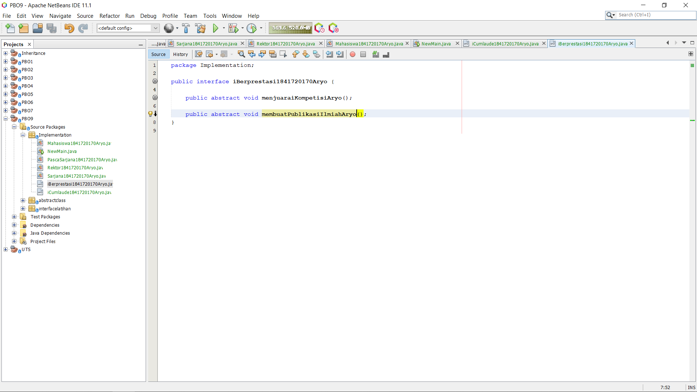
link kode program :[iBerprestasi](../../src/9_Abstract_Class_dan_Interface/implementation/iBerprestasi1841720170Aryo.java)

Class PascaSarjana : 
 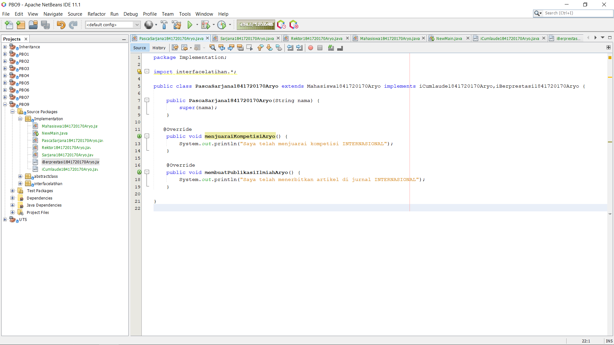
link kode program :[PascaSarjana](../../src/9_Abstract_Class_dan_Interface/implementation/PascaSarjana1841720170Aryo.java)

Class Rektor : 
 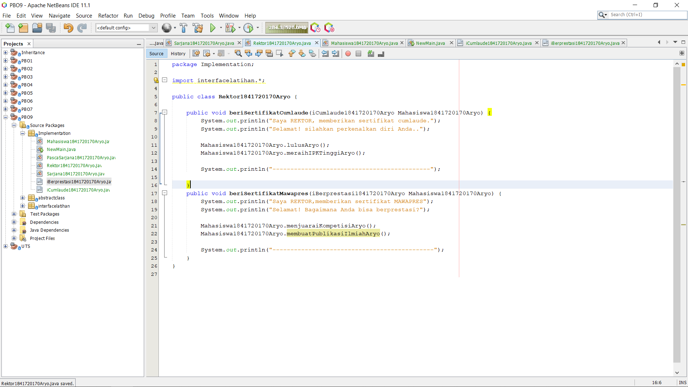
link kode program :[Rektor](../../src/9_Abstract_Class_dan_Interface/implementation/Rektor1841720170Aryo.java)

Class Main : 
 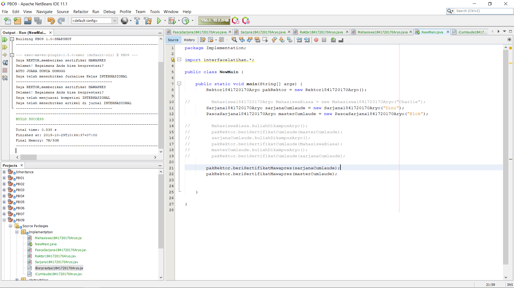
link kode program :[NewMain](../../src/9_Abstract_Class_dan_Interface/implementation/NewMain.java)

<h2>Pertanyaan diskusi:</h2>
Apabila Sarjana Berprestasi harus menjuarai kompetisi NASIONAL dan menerbitkan artikel di jurnal NASIONAL, maka modifikasilah class-class yang terkait pada aplikasi Anda agar di class Program objek pakRektor dapat memberikan sertifikat mawapres pada objek sarjanaCumlaude

## <h1>Kesimpulan

Pada interface: Semua property secara otomatis public, static dan final. Semua method adalah public Abstract class hanya bisa diwariskan satu kali (single inheritance) sedangkan interface bisa diimplementasikan lebih dari satu. Kapan menggunakan abstract class atau interface? Gunakan abstract class jika: Kita ingin berbagi code/mewariskan code yang sama dengan class-class yang berhubungan. Kita ingin membuat beberapa class dengan method dan property yang hampir sama. Kita ingin mendeklarasikan property yang tidak static dan tidak final. Dengan cara ini kita bisa mendefinisikan method dengan implementasi yang berbeda-beda di tiap class yang mewariskan abstract class tersebut. Gunakan interface jika: Kita ingin mengimplementasikan interface ke beberapa class yang tidak berhubungan secara hirarki. Kita ingin menspesifikasikan behavior dari beberapa object, namun tidak mau tau bagaimana implementasi dari behavior tersebut. Kita ingin memanfaatkan multiple inheritance

## <h1>Pernyataan Diri

Saya menyatakan isi tugas, kode program, dan laporan praktikum ini dibuat oleh saya sendiri. Saya tidak melakukan plagiasi, kecurangan, menyalin/menggandakan milik orang lain.

Jika saya melakukan plagiasi, kecurangan, atau melanggar hak kekayaan intelektual, saya siap untuk mendapat sanksi atau hukuman sesuai peraturan perundang-undangan yang berlaku.

Ttd,

Aryo Satyo Wandowo Adi - 05

